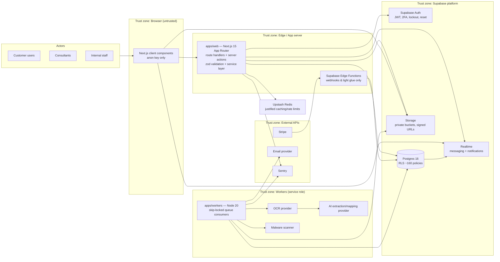

# CarbonTally v1.0 — Application Architecture

*Lead Software Architect's specification — UK launch, Ireland beta. Database frozen at RC2: this document specifies no schema change, no SQL, no seed data, no PDF invoice generation. Post-migration object names are used throughout (`emission_factors`, `emission_factor_id`, `emission_factor_used`, `default_factor_year`; `facilities.eircode`, `organizations.is_active`, `facilities.meter_mpan_mprn`, `suppliers.sort_code`).*

## 0. System Context

CarbonTally is a multi-tenant carbon-accounting SaaS. Three actor classes work in one codebase: **customers** (organisation owners/admins/members/viewers via `organization_members.role`), **consultants** (cross-organisation access granted per client via `consultant_clients` and the `consultant_firm_members.client_access` array), and **internal staff** (operations, manual review and QC via `staff_profiles`/`staff_roles`). The database is Supabase Postgres 16 with an RLS-first posture (~160 frozen policies); all untrusted traffic reaches data only through RLS, and only the service role — held exclusively server-side — bypasses it.

## 1. Frontend

`apps/web` is a Next.js 15 App Router application (React 19, TypeScript, Tailwind + shadcn/ui) and is the only user-facing surface. It is a **single application serving three workspaces** (§11). Layout and data conventions:

- **Server Components by default.** Data fetching happens in Server Components through the typed service layer using a per-request Supabase client bound to the caller's JWT. The anon key is the only key ever shipped to the browser; the service-role key is never client-side (frozen decision).
- **Client components are confined to interactivity**: forms (react-hook-form + zod resolver sharing the API-layer schemas), upload widgets, Realtime subscriptions (message threads, notification badges, processing status), and dashboards.
- **Design system**: shadcn/ui primitives on Tailwind tokens; UK English copy; currency and locale rendered from the organisation's `country`/`currency` (GB → GBP, IE → EUR) with E.164 phone display, GIR postcode / Eircode formatting handled by shared presentation utilities in `packages/*`.
- **Status vocabularies rendered from central constants** that exactly match the frozen CHECK IN-lists (`customer_documents.status`, `document_processing_queue.status`, `processing_queue.queue_status`, `organization_members.role`, `customer_subscriptions.status`). The UI never invents a state outside these lists.
- **Optimistic UI only where idempotent** (messaging read state); pipeline state is always rendered from the frozen queue tables, never from client memory.
- Feature flags: Ireland beta surfaces (Eircode-first address forms, EUR defaults) are gated on `organizations.country = 'IE'` and a launch flag, not on compile-time builds.

## 2. Backend

The backend is Next.js route handlers plus server actions behind a **typed service layer** (`packages/services` consumed by `apps/web`); handlers and actions contain no business logic — they authenticate, authorise via org-context resolution, validate input with zod, delegate to the service layer, and shape the response.

- **Zod is the format-validation authority at the API boundary** (frozen decision). The database enforces exactly four integrity shapes — IN-lists, ranges, presence, uniqueness — while the API layer owns all format validation: VAT with HMRC MOD97 checksum, Companies House / CRO company numbers (8-char CH when `country='GB'`, 6-digit CRO when `country='IE'`), GIR-valid postcodes, Eircode shape plus routing-key allowlist (a living registry kept in app configuration, deliberately not frozen in a CHECK), libphonenumber with E.164 storage, and normalisation at write so that DB uniqueness applies to the *normalised* value.
- **Service layer** is organised by module (§12) and is the only code that constructs queries. Every query in an `authenticated` context carries the caller's JWT and relies on RLS; every service-role call (which bypasses RLS) must filter `organization_id` explicitly in code — a code-reviewed invariant.
- **Server actions** for mutations from app UI; **route handlers** for non-UI entry points (signed-URL refresh, export downloads, health).
- **Supabase Edge Functions are restricted to webhooks and light glue** (frozen): Stripe webhook receipt/signature verification and small event translations that enqueue into `processing_queue`. No business logic lives at the edge.
- **Corrections model**: the frozen schema makes negative quantities impossible by design (range CHECKs ≥ 0). The backend therefore implements corrections as **positive rows with a correction type/flag** — reversal semantics live in the service layer, never as negative numbers.

## 3. Supabase

Supabase supplies four platform capabilities; usage is frozen:

| Capability | Use | Posture |
|---|---|---|
| Postgres 16 | System of record (~90 tables) | RLS enabled on every tenant table; ~160 policies frozen at RC2; helpers `is_org_member(uuid)`, `is_org_active(uuid)`; no FORCE ROW LEVEL SECURITY |
| Auth | Sole identity provider | Owns JWT issuance, 2FA, lockout, password reset; `users.password_hash` is a dead column, never written (frozen decision) |
| Storage | Document and export files | Private buckets, tenant-prefixed paths, short-lived signed URLs |
| Realtime | Messaging + notifications | Channels authorised via RLS-backed subscriptions; no business events carried |

The service role bypasses RLS and is therefore confined to three contexts: the app server's privileged operations (organisation creation — intentionally no INSERT policy for `authenticated` on `organizations`), workers, and the erasure procedure. Frozen functions in scope: `anonymise_user(uuid, uuid, text)` (irreversible erasure, actor-guarded), `set_updated_at()` (trigger helper on mutable tables; the six append-only log tables are deliberately excluded).

## 4. Storage

Supabase Storage holds all customer file content in **private buckets**; nothing is public. Conventions:

- **Tenant-prefixed paths**: `documents/<organization_id>/<document_id>/<filename>`, `generated-reports/<organization_id>/reports/…/<version>` (report exports in the dedicated `generated-reports` bucket), and chat attachments under the `documents` bucket at `documents/{organization_id}/attachments/{message_id}/…`. The prefix makes per-tenant audit, erasure support and lifecycle rules tractable, and is re-asserted by the API layer on every signed-URL issuance.
- **Signed URLs, short-lived** (minutes, single-purpose), issued by the service layer only after an RLS-checked authorisation read against the owning row. Upload uses signed upload URLs; the server never proxies file bytes it does not need to inspect.
- **Scan-then-move with quarantine retention**: uploads land in the `temp-uploads` bucket and are malware-scanned there before the complete-move into `documents`; only scan-clean objects are promoted. Infected files are **retained** in a `quarantine/` prefix for investigation rather than deleted immediately. The UI can list an uploaded document's row immediately, but the content URL is only issuable once the pipeline marks the scan clean.
- **Size discipline**: `file_attachments.file_size` is int8 (2 GB+ reachable by invoice bundles); the API layer enforces per-plan upload limits before issuing the upload URL, because Storage itself is not the policy authority for plan entitlements.
- **Checksum**: SHA-256 computed at upload and stored in `customer_documents.file_checksum` for duplicate detection (advisory in v1.0 — a duplicate prompt, not a hard UNIQUE; uniqueness enforcement is a v1.1 item tied to duplicate-resolution UX).

## 5. Realtime

Supabase Realtime is used for **messaging and notifications only** (frozen):

- **Messaging**: conversation channels keyed to `conversations`/`messages`; channel authorisation resolves through RLS so a subscriber sees only rows their JWT already permits. Typing indicators and presence remain table-backed in v1.0 (`typing_status`, `user_presence` with interim UNIQUE + purge); migration to Realtime Presence is a v1.1 item.
- **Notifications**: per-user channels deliver badge/unread events that mirror `notifications`; the unread-count partial index serves the badge query on reconnect.
- **Pipeline status** (upload → OCR → review progress shown on the document detail screen) is delivered via Realtime **postgres_changes subscriptions on the queue tables**, which inherit RLS — no bespoke event bus is introduced. Realtime is a delivery mechanism, not a source of truth: every subscription event triggers a re-fetch through the authorised read path.

## 6. OCR

OCR is the second compute stage of the document pipeline (§20), executed by `apps/workers`:

- Workers claim `document_processing_queue` rows (`status = 'pending'`) with skip-locked against the `dpq_claim_idx` partial predicate; the claim query's status subset matches the frozen partial-index predicate exactly.
- The worker fetches the file via a service-role signed URL (scan-clean prefix only), submits it to the OCR provider, and persists structured output into `customer_documents.extracted_data` (ADR-protected jsonb — v1.0 does not promote typed invoice columns; that promotion is v1.1 against query logs).
- OCR confidence is recorded on the 0–100 scale (frozen K3c assumption); low-confidence documents are routed to `manual_review_queue` by status transition rather than silently retried.
- OCR failure transitions the row to `failed` with a processing log entry in `processing_logs`; retries follow the plan's retry + dead-letter policy.

## 7. AI Services

AI services perform extraction enrichment and supplier/category mapping; they are worker-side integrations, never called from the browser or edge:

- **Extraction**: the OCR text/json is passed to the AI provider for field extraction (supplier, dates, quantities, currency, meter references such as `facilities.meter_mpan_mprn` candidates). Output lands in `extracted_data` with per-field confidence; rows advance `document_processing_queue.status` to `ai_extracted`.
- **Mapping**: the AI proposes supplier matching (trigram-assisted "did you mean?" against `suppliers.name`/`vat_number` via `pg_trgm`), category assignment, and the emission-factor candidate. The factor decision is recorded on the queue row as `emission_factor_used`, and manual-extraction paths record `manual_extraction_items.emission_factor_used` under the post-migration name. AI mapping hints carry foreign keys (`ai_mapped_supplier_id` family) — an AI suggestion is a hint row, not data, until a human or an approved auto-confirm rule promotes it.
- **History**: AI interactions are journaled in `ai_content_history` for auditability and prompt/version traceability.
- **Guardrails**: confidence below threshold routes to `manual_review` / `manual_extraction` statuses and staff workspaces; `qc_required` and `customer_approved` flags on `document_processing_queue` are NOT NULL and drive the QC and customer-review steps. The AI never writes `emissions_logs` directly — calculated emissions are written by the calculation step after confirmation, referencing `emission_factor_id` and carrying `unit` and `scope`.

## 8. Reporting

- **Data basis**: reports read confirmed `emissions_logs` rows (unit + scope present, values ≥ 0 by frozen CHECK), joined to `emission_factors` for provenance (`factor_source`/`factor_set`, e.g. DEFRA-DESNZ for GB, SEAI/EPA for IE) and filtered by the organisation's `default_factor_year` unless a report overrides the reporting year.
- **Versioning**: every generated report has immutable `report_versions(report_id, version_number)` (unique-backed) with `is_current` unambiguous; `report_comments` hang off versions. `report_templates` define structure; `export_history` records each export.
- **Generation**: heavy report assembly is a background job in `report_generation_queue`, claimed by workers with skip-locked (`report_generation_queue_claim_idx`); exports are written to Storage under the tenant prefix and delivered by signed URL. **PDF invoices are out of scope for v1.0** (frozen — no invoice PDFs are produced); PDF **report exports** are in scope and are delivered via the PDF Generation Worker into the `generated-reports` bucket, alongside CSV/XLSX/data packs assembled from query results.
- **Ireland correctness**: factor resolution is country-aware — an IE facility's Scope 2 must resolve to the IE factor set, never silently to DEFRA; the Gate 3 Dublin fixture is the permanent regression guard.
- **Aggregations** run through the tenant-composite indexes (`emissions_logs(organization_id, start_date)`); SECR-style intensity ratios use `organization_metadata.total_floor_area_sqm`/`occupied_floor_area_sqm`.

## 9. Messaging

- **Model**: `conversations` → `conversation_participants` → `messages`, with `file_attachments` for message files and `message_activity_log`/`conversation_activity_log` append-only journals. `organization_id` is NOT NULL on `conversations` and `messages` (frozen tenancy closure) — every thread belongs to exactly one tenant, including consultant↔client threads.
- **Reads**: paginated by `messages(conversation_id, created_at)`; read state uses `conversation_participants.last_read_at` as the canonical mechanism by convention (derivation enforcement is v1.1), with `read_by` arrays treated as display caches.
- **Writes**: server actions validate with zod, insert through RLS; attachments go to Storage tenant paths and are malware-scanned before download URLs are issuable.
- **Delivery**: Realtime channels per conversation (§5); unread badges derive from the notifications path.

## 10. Notifications

- **Storage**: `notifications` carries the per-user event; the `notification_delivery`/`notification_delivery_log` duplication is resolved by keeping one canonical delivery record (v1.0.x consolidation; both tables used as-is in v1.0); `recipient_type` values are app-constant-driven with the IN-list CHECK scheduled v1.0.2.
- **Fan-out**: in-app events are inserted by the service layer inside the same transaction as the triggering mutation where practical (e.g. review requested, report ready, subscription past_due), then pushed over Realtime; email notification copies flow through the email pipeline (§21) and are journaled in `email_logs`.
- **Badge**: unread-count query uses the frozen partial index; preferences are global until per-user channel preferences land in v1.1.

## 11. Role-based Workspaces (customer / consultant / staff)

One Next.js codebase serves all three actor classes; separation is **resolved at the layout layer from identity claims plus profile tables**, not from separate apps.

| Concern | Customer workspace | Consultant workspace | Staff workspace |
|---|---|---|---|
| Identity basis | `organization_members` row (role ∈ owner/admin/member/viewer) | `consultant_profiles` + `consultant_firm_members` | `staff_profiles` + `staff_roles` |
| Org context | Switches among own memberships | Switches among granted clients via `consultant_clients` / `client_access` array | Operates cross-tenant inside staff screens; staff reads are governed by the frozen staff RLS policies |
| Primary screens | Dashboard, uploads, documents, review/approve (`customer_verifications`, `customer_review_log`), emissions, reports, suppliers/facilities, billing/subscription, messages | Client portfolio, per-client workspace (same screens, client context), `consultant_tasks`, `consultant_billing` (currency-denominated), firm management | `processing_queue` ops, `manual_review_queue` / `manual_extraction_batches`/`items`, QC, `staff_workload`/`staff_performance`, SLA monitoring, tenant suspend/offboard |
| URL structure | `/(customer)/…` route group | `/(consultant)/…` route group | `/(staff)/…` route group |

Mechanics:

- **Workspace resolution**: a root server layout loads the user's memberships, consultant grants and staff profile, computes the available workspaces, and redirects to the highest-privilege default. The active organisation (for customer/consultant contexts) is carried by a stateless `X-Organization-Id` header that is **re-validated on every request** against membership/grant; no server-side session state is held for org context, and the header is never trusted without that re-validation.
- **Shared screens, scoped data**: document list, reports and messaging components are shared across workspaces; scoping comes entirely from the JWT/org context at the service layer, so a consultant viewing a client tenant is exercising the *same* components with a different resolved org context. This is deliberate: one screen codebase, RLS as the isolation authority.
- **Capability gating**: UI affordances (edit vs view, approve buttons, staff-only QC actions) are driven by a server-computed capability map (role + `client_access` + staff role), with the hard enforcement remaining RLS + service-layer checks — the capability map renders, it does not protect.
- **Suspended tenants**: when `organizations.is_active = false`, write policies block member writes while reads still work; all three workspaces render the tenant as read-only with an explicit banner, and staff screens expose the suspend/reactivate action.

## 12. Module Communication

The monorepo (`apps/web`, `apps/workers`, `packages/*`) communicates through three disciplined channels; **no module reaches across another's tables directly**.

| Module | Owns tables (frozen) | Exposes (services) | Consumes |
|---|---|---|---|
| Identity & tenancy | `users`, `organizations`, `organization_members`, `organization_metadata`, `user_invitations`, `roles` | org CRUD (creation service-role only), membership management, org-context resolution, suspend/offboard (`is_active`/`archived_at`) | Supabase Auth |
| Consultants | `consultant_profiles`, `consultant_clients`, `consultant_firm_members`, `consultant_tasks`, `consultant_billing` | client-grant management, consultant workspace services, billing records | Identity & tenancy |
| Staff ops | `staff_profiles`, `staff_roles`, `staff_workload`, `staff_performance`, `processing_queue`, `processing_assignments`, `processing_steps`, `processing_logs`, `processing_audit_trail`, `review_assignment_history`, `review_audit_trail` | queue ops, assignment, SLA reporting | Documents pipeline, Notifications |
| Facilities & assets | `facilities` (postcode/`eircode`, `meter_mpan_mprn`), `assets` | facility/asset CRUD, jurisdiction-aware address validation | Identity & tenancy |
| Suppliers | `suppliers` (incl. `sort_code`), `supplier_categories`, `product_categories` | supplier CRUD, trigram "did you mean?", bank-details masking | Facilities, Validation pack |
| Documents pipeline | `customer_documents`, `upload_batches`, `document_processing_queue`, `manual_review_queue`, `manual_extraction_batches`, `manual_extraction_items`, `document_activity_log`, `customer_review_log`, `verification_activity_log`, `customer_verifications`, `draft_entries`, `document_types`, `document_type_categories`, `file_attachments` | upload intake, pipeline state machine, review/QC actions, confirmed-entry emission | Storage, OCR/AI providers, Factors |
| Factors & emissions | `emission_factors`, `emissions_logs`, `units`, `activity_categories`, `glossary` | factor resolution (country/year/source), emission calculation | Reference data |
| Reporting | `report_templates`, `report_versions`, `report_comments`, `report_generation_queue`, `export_history` | report build/version/export | Emissions, Storage |
| Messaging | `conversations`, `conversation_participants`, `messages`, `message_activity_log`, `conversation_activity_log`, `typing_status`, `user_presence` | threads, participants, attachments | Realtime, Storage |
| Notifications | `notifications`, `notification_delivery_log` | fan-out, badge counts, delivery journal | Realtime, Email |
| Billing & subscriptions | `customer_subscriptions`, `usage_tracking`, `system_settings` | plan limits (`used ≤ limit`), Stripe reconciliation | Stripe (via Edge webhook), Identity |
| Compliance & logs | `audit_logs`, `activity_logs`, `activity_feed`, `user_activity_log`, `email_logs`, `email_templates`, `export_history` | append-only write helpers, audit query (read-only) | All modules (writes), none (reads cross-module) |
| Marketing/beta (purge at GA) | `waitlist`, `beta_users`, `beta_access_codes`, `user_feedback` | feedback capture, GA purge runbook | — |

Channels:

1. **Service layer (synchronous)**: typed functions in `packages/services`; cross-module reads go through the owning module's read functions. Zod schemas in `packages/validation` are shared between client forms and the API boundary so format rules have one definition.
2. **Events (asynchronous)**: state transitions on the frozen queue tables are the event contract. Modules signal by writing queue rows / status transitions (`pending` → `processing` → `ai_extracted` → `manual_review` → … → `approved`); workers and Realtime subscriptions react. No separate message broker in v1.0 — the database is the bus, which matches the frozen multi-queue ADR.
3. **Shared packages**: `packages/types` (generated DB types + domain types), `packages/validation` (zod pack: VAT/MOD97, CH/CRO, GIR postcode, Eircode shape + routing-key registry, E.164), `packages/config` (status constants matching the frozen CHECK IN-lists, country/currency maps), `packages/logging` (pino setup), `packages/supabase` (client factories: browser-anon, server-JWT, service-role — the last import-guarded so it cannot be bundled to the client).

## 13. Authentication

Authentication is owned by **Supabase Auth** (frozen decision): sign-in, JWT issuance and refresh, 2FA/TOTP, lockout, and password reset are platform responsibilities; no per-user `totp_secret`/lockout columns exist and `users.password_hash` is a dead column.

- **Session model**: Supabase SSR pattern — short-lived access JWT plus refresh token held in httpOnly cookies; Server Components and route handlers construct a per-request Supabase client from the session. Middleware refreshes expiring sessions.
- **Org switching**: the active organisation is resolved server-side per request (see §11); switching re-validates membership/grant and never carries the previous tenant's rows (Gate 4 switching test).
- **Invitations**: `user_invitations` is the canonical invite path (hashed token, expiry, status); `pending_invites` is write-blocked. Password reset follows latest-valid-wins semantics against `password_reset_tokens` (hashed tokens; UNIQUE on `user_id` dropped).
- **Consultant API keys**: `consultant_profiles.api_key` is stored hashed (SHA-256 + lookup prefix, rotation columns); keys are shown once at issuance.

## 14. Authorisation

Authorisation is **RLS-first**: the ~160-policy frozen set (36 tenant tables × 4 CRUD, plus `organizations`, `users`/`notifications` and reference-table read policies) is the isolation authority, evaluated under the caller's JWT on every query from every zone that connects as `authenticated`.

- **Role hierarchy**: `organization_members.role` ∈ {owner, admin, member, viewer} gates in-org capabilities at the service layer (invite, billing, approval, export), with RLS guaranteeing the tenant boundary regardless of role.
- **Consultant cross-org**: policy unions over `consultant_clients` grants and the `consultant_firm_members.client_access` uuid[] array (GIN-indexed); a consultant's JWT sees exactly granted tenants.
- **Staff**: `staff_profiles`/`staff_roles` policies grant the operations surfaces; staff privileges are narrowest-feasible and always journaled.
- **Helper functions**: `is_org_member(uuid)` and `is_org_active(uuid)` are the frozen policy primitives; write policies require `is_active = true`.
- **Service-role discipline**: where the service role is used (bypasses RLS), the service layer filters `organization_id` in code; this invariant is code-review gated and penetration-tested (Gate 4).

## 15. Error Handling

**Taxonomy** (defined in `packages/types`, rendered by `apps/web`, logged by everything):

| Class | Origin | User-facing shape | Operational handling |
|---|---|---|---|
| ValidationError | zod at API boundary | 400 with field-level messages; form inline errors | Debug log only; no Sentry unless volume anomaly |
| AuthError | session/JWT/org-context | 401/403 with safe generic copy ("You don't have access to this organisation") | Warn; repeated 403s alert (possible probing) |
| NotFound / cross-tenant miss | RLS zero-rows | 404 (deliberately indistinguishable from "exists but forbidden") | Info |
| ConflictError | frozen UNIQUE/CHECK violations (e.g. duplicate supplier VAT, out-of-list status) | 409 with domain copy ("A supplier with this VAT number already exists") | Info; constraint name mapped to copy via a frozen-name → message table |
| QuotaError | plan limits (`usage_tracking`, `used ≤ limit`) | 402/429 with upgrade CTA | Info |
| PipelineError | OCR/AI/scan stage failures | Document status `failed` with retry affordance | Error + Sentry; dead-letter after retry budget |
| ExternalError | Stripe/email/provider failures | 502 with retry guidance | Error + Sentry; circuit log |
| SystemError | unforeseen | 500 generic page | Fatal-ish: Sentry with full context, pino error |

Boundaries: zod runs first (nothing unvalidated reaches a service); service layer translates DB constraint violations into Conflict/Validation domain errors (never leaking raw Postgres errors to the client); workers catch per stage, transition status, and log structured context (`organization_id`, document id, queue id, attempt). User-facing copy is UK English and never exposes table/column names; operational logs carry the frozen names.

## 16. Logging

- **pino structured logging everywhere** (`packages/logging`): JSON lines with `service` (web/worker/edge), `request_id`, `organization_id` where resolved, `user_id` hash, route/job, latency, outcome. Redaction list covers tokens, signed URLs, bank details, email bodies and anything PII-classified in the inventory.
- **Sentry** on web, workers and edge glue: unhandled exceptions, PipelineErrors, ExternalErrors; release-tagged; PII scrubbing before send; alerts route to on-call.
- **Correlation**: a `request_id` is minted at the edge of `apps/web`, propagated into service-layer calls and stamped onto queue rows' processing logs so a document's journey (upload → scan → OCR → AI → review → confirmed) is traceable end-to-end in one query.
- **Append-only DB logs** (`audit_logs`, `activity_logs`, `processing_logs`, `*_activity_log`, `email_logs`) are written by the service layer/workers via service role, have no `updated_at` triggers by design, and are never UPDATEd/DELETEd (privilege hardening v1.0.1; hash-chain explicitly rejected — PITR plus privilege revocation is the tamper storey).

## 17. Caching

Caching is deliberately thin — **Next.js cache plus Upstash Redis only where justified** (frozen):

| Cache | What | Justification |
|---|---|---|
| Next.js route/data cache | `emission_factors` by (year, country), reference data (`units`, `activity_categories`, `glossary`, `document_types`), `report_templates` | Static-per-release reference data on hot read paths; tag-based revalidation on admin change |
| Full-route/ISR | Marketing pages only | Never tenant data — RLS-bound reads are never cached across users |
| Upstash Redis | Rate-limit counters (edge + per-org + auth endpoints); ephemeral duplicate-prompt dedupe; org-context resolution memo per request burst | Distributed counters cannot live in Next.js memory; everything else measured first |
| Explicitly not cached | `emissions_logs` aggregations, document lists, messages, notifications | Correctness of reported carbon numbers and tenant freshness outrank marginal latency; tenant composites (`customer_documents(organization_id, created_at)`, `emissions_logs(organization_id, start_date)`) already serve these paths |

Invalidation rule: any cache key that could span tenants is keyed with `organization_id`; no cross-tenant shared entry exists for mutable data.

## 18. Background Jobs

`apps/workers` (Node 20) is the only job executor. Job sources and discipline:

- **Queues (frozen tables)**: `document_processing_queue` (document pipeline), `processing_queue` (general ops jobs incl. staff workflow), `report_generation_queue` (report assembly). Workers claim with `FOR UPDATE SKIP LOCKED`-style claiming whose status predicates **exactly match the frozen partial claim indexes** (`dpq_claim_idx`, `processing_queue_claim_idx`, `report_generation_queue_claim_idx`) — a predicate/index mismatch silently disables the index and is a Gate 7 failure. The `manual_review_queue` is **staff-worked, not worker-claimed**: review items are claimed and worked by human reviewers through the staff workspace (assignment via `processing_assignments`/`review_assignment_history`), never by `apps/workers` jobs.
- **Retry + dead-letter per plan**: bounded attempts with exponential backoff and jitter; exhaustion moves the row to the terminal failure status (`failed`/`cancelled` per the frozen IN-lists) and writes a processing-log entry; staff surfaces show the dead-letter set for requeue.
- **Scheduled jobs**: Supabase-scheduled invocations enqueue work rows into the same queues (retention sweeps per the v1.0.1 schedule — `processing_logs` 90d, login/email 12m, activity 12–24m, audit 24m; usage-counter reconciliation; subscription dunning checks). Workers connect as service role and **filter `organization_id` in code**.
- **Idempotency**: every job handler is safe to re-run against the same queue row (checksum gates, status preconditions, unique-backed writes) because claiming is at-least-once.

## 19. Email Pipeline

- **Composition**: templates in `email_templates`, rendered server-side with organisation-locale copy (GB/IE English, GBP/EUR symbols).
- **Triggers**: transactional classes — invitations (`user_invitations`), password reset (Supabase Auth owned; our templates), review requests, report ready, subscription/dunning events from Stripe webhooks, notification digests.
- **Delivery**: worker jobs claimed from `processing_queue` call the email provider; every attempt is journaled in `email_logs` (12-month retention class). Failures retry with backoff and dead-letter per §18.
- **Compliance**: unsubscribe/preferences are coarse in v1.0 (per-channel preferences v1.1); transactional mail is exempt by nature. No attachments by email — documents and exports are shared by signed URL inside the app.

## 20. File Processing Pipeline

The pipeline maps one-to-one onto frozen tables and frozen status vocabularies (`customer_documents.status`; `document_processing_queue.status` ∈ pending, processing, ai_extracted, manual_review, manual_extraction, qc, customer_review, approved, rejected, completed, failed):

1. **Upload** (`uploaded`): client requests a signed upload URL from the API layer (zod-validated metadata: MIME/type allowlist, size limit per plan); file lands in the `temp-uploads` bucket pending scan. A `customer_documents` row is created (`organization_id` NOT NULL, `status='uploaded'`, SHA-256 `file_checksum` computed/recorded; `asset_id` nullable — supplier invoices have no asset), plus an `upload_batches` row for multi-file intake. At upload-**complete**, the virus scan runs in `temp-uploads` and, on a clean verdict, the object is moved into `documents` and the `document_processing_queue` row is created (`status='pending'`, `qc_required`/`customer_approved` defaulted false) — the queue row is never created at init. Duplicate check: same `file_checksum` in the org prompts the user (advisory in v1.0).
2. **Scan** (at complete, before move): infected → `failed` + object retained in the `quarantine/` prefix for investigation + notification; clean → file moved from `temp-uploads` into `documents` and the pipeline proceeds.
3. **OCR** (`processing`): text/structure extraction; output and per-page confidence stored; unreadable → `manual_extraction` directly.
4. **AI extraction** (`ai_extracted`): field extraction + supplier/category/factor mapping hints (incl. `emission_factor_used` candidate and `ai_mapped_supplier_id`); per-field confidence 0–100; `extracted_data` jsonb updated; `ai_content_history` journaled.
5. **Manual review** (`manual_review` / `manual_extraction`): confidence-gated routing into `manual_review_queue` and, for full keying, `manual_extraction_batches`/`manual_extraction_items` (which record `manual_extraction_items.emission_factor_used`); staff work these in the staff workspace with assignment via `processing_assignments`/`review_assignment_history`; QC step (`qc`) when `qc_required`.
6. **Customer review** (`customer_review`): where `customer_approved` flow applies, the customer confirms via `customer_verifications` (journaled in `customer_review_log`/`verification_activity_log`).
7. **Confirmed** (`approved` → `completed`): the calculation step writes `emissions_logs` (positive quantities only, `unit`, `scope`, `emission_factor_id` referencing the resolved `emission_factors` row, `calculated_kg_co2e` ≥ 0) and/or `draft_entries` for user-held items; corrections are positive typed rows. `customer_documents.status` becomes `verified`/`approved`; notifications fan out.

**Request-lifecycle walkthrough — an uploaded invoice becomes calculated emissions:**

1. Customer (member role) posts metadata to the upload action; zod validates; service layer asserts plan quota (`usage_tracking`), issues signed upload URL and creates the `customer_documents` row (status `uploaded`) under RLS; on upload-complete the virus scan runs in `temp-uploads`, the clean object moves into `documents`, and the `document_processing_queue` row is created (status `pending`).
2. Malware scan runs clean at upload-complete (object moved into `documents`); worker claims the queue row; OCR extracts text; AI maps supplier "City Electrical" (trigram confirm), extracts 412 kWh, proposes the current-year GB grid factor — recorded as `emission_factor_used`; confidence 62 on quantity → routes to `manual_review`.
3. Staff reviewer corrects nothing, QC passes (`qc_required` false path); customer confirms in review screen; `customer_verifications` row written.
4. Calculation step resolves `emission_factor_id` for the org's `default_factor_year` (GB, DEFRA-DESNZ set — an IE facility would resolve the SEAI/EPA IE factor), computes `calculated_kg_co2e = 412 × multiplier`, inserts the `emissions_logs` row with `unit='kWh'`, `scope=2`.
5. Document row → `approved`/`completed`; notification to the uploader; dashboard aggregation picks the row up via `emissions_logs(organization_id, start_date)`; the number appears on the next report version.

## 21. Security Boundaries (trust zones)

| Zone | Identity | May do | Must never |
|---|---|---|---|
| Browser | Supabase anon key + user JWT | Call API layer, Realtime subscriptions, signed-URL up/download | Hold the service-role key; construct queries bypassing the API; trust its own org context |
| Edge (Next.js server + Supabase Edge Functions) | User JWT (server client); service role for designated ops | Validate (zod authority), authorise via org context, enqueue jobs, receive webhooks (signature-verified) | Expose service role to responses; run OCR/AI inline; trust webhook payloads unverified |
| Service role (server-side only) | `service_role` key in env/vault | Org creation, worker claims, erasure, audit writes, signed-URL issuance | Appear in client bundles, logs or error messages (import-guarded package) |
| Workers | Service role | Claim queues skip-locked, call OCR/AI/scan/email providers, write pipeline state | Serve user traffic; skip `organization_id` filters; retry unboundedly |
| External APIs (Stripe, email, OCR/AI, Sentry) | Provider credentials | Receive scoped data only (Stripe: billing ids; OCR/AI: document content under DPA; Sentry: scrubbed events) | Receive service-role keys, full tenant exports, or credentials of any other zone |

Crossing rules: browser→edge always re-validated; edge→external always signature/secret-verified inbound and minimal-payload outbound; workers→DB always service role with coded tenant filters; nothing outside Postgres writes tables directly.

## 22. Module-boundary Table

See §12 (module → owns tables → exposes services → consumes). The boundary rules that give the table force: a module's tables are written only by its own services; cross-module needs are met by calling the owning module's service or by enqueueing a queue row; shared reference data is read-only outside the Factors module; and the six append-only log tables accept writes from every module's service layer but reads only from Compliance services. These rules are enforced by package boundaries in the monorepo (a module importing another module's table types directly is a lint error), with RLS as the runtime backstop.

---

*Document 01 of the architecture set. Companion: `07_security_architecture.md`. All object names per RC2 freeze; no SQL, seed data or code is specified here.*
