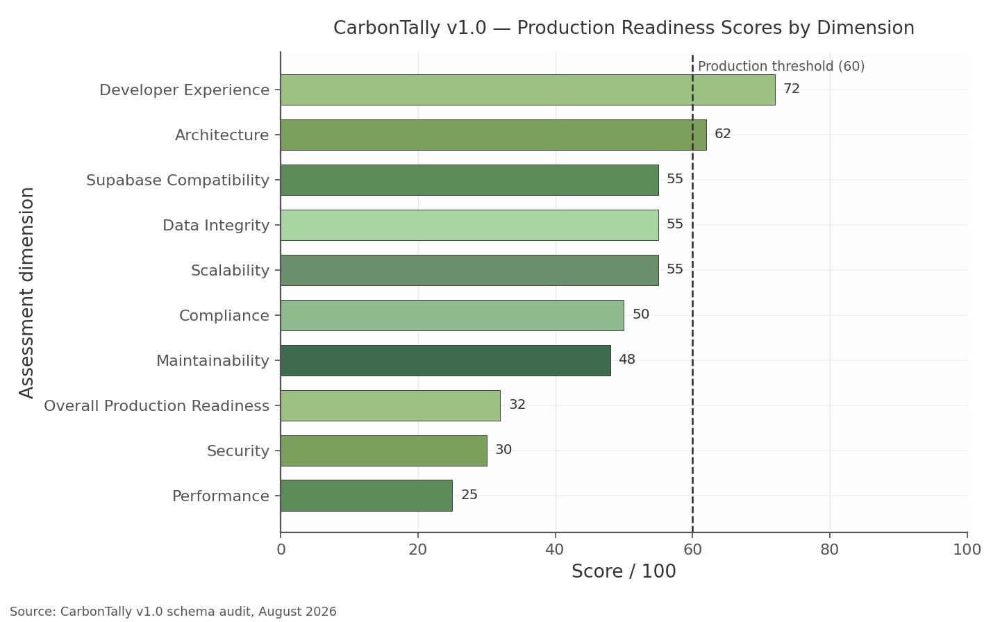

# CarbonTally v1.0 Database Production Readiness Review

*UK & Ireland Launch Edition — prepared 4 August 2026; scope: UK and Irish business practices only; ADRs treated as approved; review-and-recommend only (no SQL, no migrations, no redesign).*

## 1. Executive Summary

CarbonTally's ~90-table Supabase/PostgreSQL schema shows broad, thoughtful domain coverage — an emissions pipeline, a QC and SLA estate, a consultant channel and a versioned reporting spine — but it is **not yet production-ready** for paying UK and Irish customers. The overall readiness score is 32/100. Nothing found requires redesign: every defect class is addressable through additive columns, CHECK constraints, indexes and documented procedures within the approved architecture. What is required is a focused hardening sprint before launch, sequenced around five launch-blocking themes.

1. **The Ireland blocker.** `facilities.postcode` is NOT NULL and `facilities` has no `eircode` column, although `organizations`, `suppliers` and `consultant_profiles` carry both; Ireland has no postcode system, so an Irish customer can create an organisation but cannot register the site whose emissions the product exists to measure.
2. **Jurisdiction data integrity.** `country`, six `currency` columns, three `vat_number` columns, `company_number`, `postcode` and `eircode` are all unconstrained free text — yet every jurisdiction rule (VAT format, postcode versus Eircode, GBP versus EUR, timezone, factor selection) keys off them.
3. **A UK-only emission factor model in a UK+IE product.** `defra_conversion_factors` carries no `unit`, `scope` or `source`, no SEAI/EPA set exists, and `emissions_logs.raw_quantity` is unit-less — a DEFRA grid factor applied to a Dublin site returns a wrong Scope 2 figure with no warning.
4. **Zero secondary indexes and unverifiable foundations.** No secondary index, foreign key, CHECK or RLS policy is visible in the schema dump across ~90 tables; every tenant-filtered list endpoint will sequential-scan, and the multi-tenant isolation promise cannot currently be evidenced.
5. **Plaintext secrets and absent governance.** `consultant_profiles.api_key`, bearer tokens and supplier bank details (`bank_account`, `iban`, `swift_code`) sit in plaintext, and `system_settings.audit_log_retention_days`/`data_retention_days` are unenforced — leaving UK GDPR storage-limitation and erasure duties, and the Companies Act retention duty, unreconciled.

The genuinely good news deserves equal clarity. The notification estate (`notifications`, `notification_templates`, delivery tracking), the reporting spine (`report_templates`, `report_generation_queue`, `report_versions.is_current`), the consultant white-label columns on `consultant_profiles`, structured address columns on three of four address tables, SECR intensity denominators in `organization_metadata` (`annual_revenue`, `average_employees`, floor area), and a settings layer that already anticipates multiple emission factor sets (`system_settings.default_emission_factor_set`) are all sound foundations that the recommendations below protect rather than replace.

**Reading guide.** Section 2 presents the scoring; Section 3 assesses architecture. Sections 4–5 assess UK and Ireland readiness; 6–7 catalogue missing fields and the validation matrix; 8–9 cover performance and security; 10 addresses UX; 11 future expansion. Section 12 consolidates the phased remediation roadmap; 13 records the changes not recommended because they conflict with approved ADRs; 14 delivers the final production readiness verdict and the go/no-go gate.

## 2. Overall Readiness Score

| Dimension | Score /100 |
|---|---|
| Architecture | 62 |
| Performance | 25 |
| Security | 30 |
| Scalability | 55 |
| Maintainability | 48 |
| Compliance | 50 |
| Data Integrity | 55 |
| Developer Experience | 72 |
| Supabase Compatibility | 55 |
| **Overall Production Readiness** | **32** |

One-line justification per dimension:

- **Architecture (62):** strong domain breadth undermined by three parallel processing queues, 9+ audit log tables, duplicate invitation/delivery/messaging concepts and a UK-only factor model.
- **Performance (25):** zero secondary indexes — every tenant filter, join, queue-claim and log query sequential-scans, with no retention or partition plan for the append-only giants.
- **Security (30):** RLS unverifiable and structurally undermined by nullable `organization_id` columns, three competing permission models, and plaintext `api_key`, tokens and supplier bank details.
- **Scalability (55):** UUID keys, tenant-scoped rows and usage tracking are good foundations; missing indexes, jsonb hot paths and counter drift cap headroom.
- **Maintainability (48):** ~25 free-text `status` fields, four competing read-state mechanisms and three sources of truth for approval, fiscal year and contacts make safe change expensive.
- **Compliance (50):** Companies House, HMRC VAT, SIC 2007, SECR financial-year, Eircode, CRO and SEAI validations are all absent; Irish facilities cannot be inserted at all.
- **Data Integrity (55):** core business fields (`country`, `currency`, VAT, company number, postcode/Eircode, percentages, emission values) are free text with virtually no CHECK constraints.
- **Developer Experience (72):** consistent UUID/timestamptz/jsonb patterns, but six unconstrained currency columns, triplicated contact models and DEFRA-hard-coded naming for a two-market product.
- **Supabase Compatibility (55):** the platform fit is good, but DB-backed `typing_status`/`user_presence` ignore Realtime Presence, `users.password_hash` collides with Supabase Auth, and service-role/RLS boundaries are undefined.
- **Overall (32):** the weighted picture — broad coverage, blocked by indexes, unverifiable RLS/FK foundations, plaintext secrets and absent retention enforcement.

The chart sorts the dimensions against a 60-point production threshold: only Developer Experience and Architecture clear it. The distribution matters more than the mean. The two lowest scores — Performance and Security — are precisely the dimensions where defects are invisible in a demo and catastrophic in production: a sequential scan is indistinguishable from an indexed query at fifty rows, and a nullable `organization_id` leaks nothing until the row that matters is written. Conversely, the high Developer Experience score confirms that the remediation programme is working with the grain of the codebase, not against it: the conventions a hardening sprint needs (consistent key types, additive CHECKs, CHECK-in lists rather than enums) are already the codebase's own idioms. The Overall score of 32 is not an average of the dimensions but a gate: no UK/IE launch should proceed while any dimension that touches customer money or regulated data sits below threshold.

**Evidence caveat.** The schema dump showed no secondary indexes, RLS policies, foreign keys or CHECK definitions — only primary keys, a handful of UNIQUE constraints and nullability. If these exist in migration files not supplied to the audit, the Performance and Security scores rise accordingly; the structural findings — the Ireland blocker, the factor-model gap, plaintext secrets, unenforced retention and the architectural duplications of Section 3 — stand regardless, because they concern columns and tables that do not exist rather than constraints that might.

## 3. Architecture Assessment

### 3.1 Structural Strengths

The emissions pipeline runs end to end: `customer_documents` and `upload_batches` feed `document_processing_queue`, extractions land in `extracted_data` jsonb, and results resolve to `emissions_logs` joined to `defra_conversion_factors`. The QC/SLA estate is unusually complete for a v1.0 — `qc_checks`, `qc_checklists`, `qc_errors`, `sla_definitions`, `sla_compliance` and `business_hours` give operations real levers. The consultant channel (`consultant_profiles`, `consultant_clients`, `consultant_billing`) carries white-label branding columns that make the v1.1 channel story credible, and the notification estate is genuinely production-grade. These strengths are why the Architecture score leads the operational dimensions.

### 3.2 Structural Weaknesses

| Weakness | Evidence (tables) | Consequence | Severity | Effort | Migration Risk | Implement |
|---|---|---|---|---|---|---|
| Three parallel processing queues | `manual_review_queue`, `processing_queue` (+`processing_assignments`/`processing_steps`), `document_processing_queue`; `customer_documents` holds both `manual_review_queue_id` and `processing_queue_id` | The single biggest coherence problem: ~70% purpose overlap, divergent status, a document able to sit in two queues at once | 🟠 High | Large | High | v2.0 |
| 9+ audit/activity log tables | `audit_trail`, `audit_logs`, `activity_logs`, `staff_activity_log`, per-domain `*_activity_log`, `email_logs`, `login_history` | No single timeline per document; auditors must union tables; retention multiplied across stores | 🟠 High | Large | High | Consolidation never (ADR); unified view v1.1 |
| Duplicate invitation tables | `pending_invites` (no token, expiry or status) vs `user_invitations` (full lifecycle) | The weaker table is a security downgrade still writable | 🟠 High | Small | Low | v1.0 |
| Duplicate notification delivery | `notification_delivery` vs `notification_delivery_log` — identical column sets | Delivery state can be written twice and read inconsistently | 🟠 High | Small | Low | v1.0 |
| Duplicate review-history tables | `customer_review_log`, `review_audit_trail`, `review_assignment_history` | Two tables record the same assignment changes with old/new values | 🟡 Medium | Medium | Medium | v1.1 |
| Three user-identity tables | `users`, `staff_profiles` (own UNIQUE `email`, duplicating `users.email`), `consultant_profiles` | Identity drift; two sources of truth for the same person | 🟡 Medium | Medium | Medium | v1.1 |
| Duplicated communication models | `conversations`/`messages`/`conversation_participants` vs `customer_communication` | Two messaging channels; four competing read-state mechanisms on the messaging side | 🟡 Medium | Medium | Medium | v1.1 |
| Triplicated QC paradigms | `qc_*` column sets on three queue/batch tables vs standalone `qc_checks`/`qc_checklists`/`qc_errors` | QC as columns and QC as tables run in parallel with no link | 🟡 Medium | Large | High | v2.0 |

The pattern across all eight rows is the same: a concept was modelled twice at different moments and neither version was retired. Individually each duplication is survivable; collectively they create a schema where the same business question — "what is happening to this document?" — has three defensible answers. That is why the queue finding ranks first: the queues sit on the AI pipeline's critical path, and `customer_documents` carrying two queue foreign keys proves the overlap is live, not vestigial. Crucially, the ADRs appear to bless the multi-phase pipeline and the per-domain log design, so the remedy is governance — a written data-flow contract, deprecation of the strictly weaker duplicates (`pending_invites`, one delivery table), and read-only unifying views — rather than consolidation. Section 3.5 disposes each case.

### 3.3 Business Rules Enforceability

The schema records business state generously but enforces almost none of it. `organizations` has no `is_active`, `status` or `archived_at`, although nearly every child table (`suppliers`, `facilities`, `assets`, `organization_members`) carries `is_active` — a churned customer cannot be suspended without deleting audit evidence. Soft-delete is asymmetric: `organization_files` has `deleted_at` and `messages` a full soft-delete set, but `customer_documents`, the primary AI-pipeline entity, has neither. Duplicates are unblocked at the exact points the AI pipeline amplifies them: no unique constraint on `suppliers(organization_id, name/vat_number/company_number)`, `consultant_clients(consultant_id, organization_id)` or `organization_members(organization_id, user_id)`, so `ai_mapped_supplier_id` will happily propagate a duplicate supplier into emissions data. No file-bearing table (`organization_files`, `customer_documents`, `file_attachments`) carries a `file_checksum`, so duplicate uploads and invoices are undetectable. Approval state is scattered across `organization_files.status`, `customer_verifications.status`, `approval_requests`/`approval_decisions` and `customer_approved` flags on two queue tables — five tables can disagree about whether a document is approved. Finally, fiscal-year misalignment is a silent-corruption risk: nothing ties `emissions_logs.start_date`/`end_date` to `organizations.financial_year_end` or `organization_metadata.fiscal_year_start`/`fiscal_year_end` (themselves duplicated), so out-of-period emissions enter SECR totals unchallenged. All fixes are additive uniques, CHECKs and columns; none touches an ADR.

### 3.4 Search & Reporting Readiness

**Search is not production-ready.** No `pg_trgm` trigram or full-text indexing exists on the columns customers will actually search — `organizations.name`, `suppliers.name`/`vat_number`, `facilities.name`, `customer_documents.file_name`, `users.email` — and no composite index serves the tenant-scoped list views (`(organization_id, status)`, `(organization_id, created_at)`). Extracted invoice numbers live only inside `customer_documents.extracted_data` jsonb, so "find invoice INV-2024-001" is a full-table scan of payloads. Free-text `status` across ~25 tables defeats faceted filtering through case drift alone. **SECR reporting is feasible without redesign** — the reporting spine plus `organization_metadata` denominators (revenue, employees, floor area) cover the intensity-ratio and versioning requirements, and `defra_conversion_factors.reporting_year` supports prior-year comparatives — but it is blocked in practice by the unit/scope/factor gaps of Section 1 (unit-less `emissions_logs.raw_quantity`, unit-less `co2e_multiplier`, int4 `report_generation_queue.reporting_year` unable to name a non-calendar financial year) and by the absence of an Irish factor set. CarbonTally can today produce a beautifully versioned SECR-shaped report containing indefensible numbers.

### 3.5 Redundancy Disposition Table

| Duplicate concept | Disposition | Severity | Effort | Migration Risk | Version | Notes |
|---|---|---|---|---|---|---|
| Three processing queues | **Keep all three**; write a data-flow contract naming the owning queue per lifecycle stage; add cross-queue FK assertions | 🟠 High | Large | High | Contract v1.1; rationalisation v2.0 at earliest | Full merge **NOT RECOMMENDED** — conflicts with the approved multi-phase pipeline ADR |
| 9+ audit/activity log tables | **Keep**; freeze taxonomy, document the authoritative log per domain, build one read-only unified view for support/audit search | 🟠 High | Large | High | View v1.1 | Consolidation **NOT RECOMMENDED** — per-domain log design is ADR-protected |
| `pending_invites` vs `user_invitations` | **Deprecate `pending_invites`** (strict subset: no token, expiry or status) | 🟠 High | Small | Low | v1.0/v1.1 | Security downgrade as well as duplication |
| `notification_delivery` vs `notification_delivery_log` | **Deprecate one**; identical column sets | 🟠 High | Small | Low | v1.0 | Cheapest redundancy fix in the schema |
| Review-history tables (`customer_review_log`, `review_audit_trail`, `review_assignment_history`) | **Deprecate one** of the two assignment-history tables | 🟡 Medium | Medium | Medium | v1.1 | `review_audit_trail` and `review_assignment_history` record the same events |
| `users` / `staff_profiles` / `consultant_profiles` | **Keep** profile-per-role; identity fields only in `users`; 1:1 FK uniqueness on profiles | 🟡 Medium | Medium | Medium | v1.1 | Merging identity tables **NOT RECOMMENDED** — ADR conflict |
| `customer_communication` vs conversations/messages | **Keep one channel** — the conversations estate; retire `customer_communication` writes | 🟡 Medium | Medium | Medium | v1.1 | Read-state: anoint `conversation_participants.last_read_at` canonical, derive the other three mechanisms |
| QC columns vs `qc_checks`/`qc_checklists`/`qc_errors` | **Keep both** (ADR); document which paradigm governs per stage | 🟡 Medium | Large | High | v1.1 documentation; rationalisation v2.0 | Column-to-table QC merge **NOT RECOMMENDED** in v1.x |
| `uuid[]` arrays (`read_by`, `client_access`) vs junction tables | **Keep arrays**; GIN indexes plus app-level membership hygiene | 🟠 High | Small | Low | v1.1 | Junction-table replacement **NOT RECOMMENDED** — ADR conflict |

The dispositions share one logic: where duplication is vestigial and strictly weaker (`pending_invites`, the twin delivery log), deprecate cheaply and early; where it reflects an approved architectural decision (queues, logs, profiles, arrays, QC paradigms), govern rather than merge — written contracts, canonical-source declarations and unifying views deliver most of the coherence benefit at none of the ADR risk. The unified audit view is the highest-value single item: it gives support staff, auditors and the in-app timeline one queryable story per document while leaving every underlying table untouched, and it converts the 9-table log estate from a liability into defensible breadth. Two items are deliberately *not* recommended anywhere in v1.x — queue consolidation and log consolidation — and that restraint is itself a finding: the schema's coherence debt is real, but the correct creditor payment schedule runs through documentation, deprecation and views, not through the redesign the ADRs rightly forbid.

## 4. UK Readiness Assessment

The UK is the schema's home market: Companies House, VAT, SIC and DEFRA concepts all exist as columns. Readiness therefore fails not on missing fields but on **unvalidated fields**: every downstream rule — VAT format, postcode versus Eircode, currency, timezone, factor selection — keys off `country` and `currency`, both free text (findings A5, A6, both 🔴 Critical / Small / Low risk / v1.0). Until those two are constrained, all other UK validation is built on sand. Every fix below is additive and ADR-safe.

### 4.1 Company & Tax Identity

| ID | Finding (table.column) | Severity | Effort | Migration Risk | Implement |
|---|---|---|---|---|---|
| A1 | `organizations.company_number` UNIQUE but no format CHECK for 8-character CH numbers; garbage in a unique column poisons duplicate detection and future CH API lookups. | 🟠 High | Small | Low | v1.0 |
| A2 | `*.vat_number` (3 tables) unconstrained; UK formats `GB` + 9/12 digits, `GBGD`/`GBHA` + 3. MOD97 checksum at app layer; regex CHECK in DB. | 🟠 High | Small | Low | v1.0 |
| A4 | `organizations.sic_code` / `organization_metadata.sic_code` present but unconstrained; SECR and Companies House use **SIC 2007** (five digits). | 🟡 Medium | Small | Low | v1.0 |
| C | `organizations` lacks `legal_entity_type` (Ltd, PLC, LLP, CIC); `business_structure` is free text. Entity type drives CH prefix and legal identity on reports. | 🟠 High | Small | Low | v1.0 |

The pattern is consistent and cheap to fix: the schema *knows about* UK identity fields but treats them as opaque strings — a validation layer never written, not a modelling error. Left unfixed, duplicate detection cannot work when `vat_number` and `company_number` accept arbitrary formats, and the AI pipeline writes unvalidated invoice extractions into `suppliers.company_number`/`suppliers.vat_number`, turning extraction errors into permanent master-data errors. Note (dim03 finding C9, 🟡 / v1.1): `organizations.company_number` is UNIQUE across both jurisdictions — workable only if validation is conditional on `country` (§5.2).

### 4.2 Address, Postcode & Geodata

| ID | Finding | Severity | Effort | Migration Risk | Implement |
|---|---|---|---|---|---|
| A3 | `*.postcode` (3 tables): no UK regex, no normalisation (uppercase, spaced incode); blocks Royal Mail PAF / Loqate matching and trigram search. | 🟠 High | Small | Low | v1.0 |
| D2 | Dual storage: structured columns coexist with text `registered_address`/`billing_address`/`suppliers.address` — two writers, no sync rule. Structured canonical; blobs as display cache. | 🟠 High | Small | Low | v1.0 |
| D3 | No ISO 3166-1 `country_code` anywhere; free-text `country` collects "UK", "United Kingdom", "GB", "England" — yet every jurisdiction rule keys off it. | 🟠 High | Small | Low | v1.0 |
| A10 | No UK **nation** field (England/Scotland/Wales/NI); `facilities.region` is free text overlapping `county`. Nation drives CH prefixes and bank holidays. | 🟡 Medium | Small | Low | v1.1 |
| D4 | `facilities` has `latitude`/`longitude` (good) but no `address_validation_status`/`formatted_address` — the verify-then-cache PAF/Loqate loop cannot be built. | 🟡 Medium | Small | Low | v1.1 |

The structured model maps cleanly onto PAF and Eircode lookups (finding D5 rates provider compatibility acceptable for v1.0), so the foundation is sound. What breaks is consistency: storing the same address twice means any invoice or SECR submission reading the blob can disagree with any lookup reading the columns. The fix — structured canonical, blob as display cache — is a data-entry convention, not a redesign. The normalisation gap (A3) compounds: unnormalised postcodes defeat provider matching and future `pg_trgm` similarity search alike — one missing convention, three casualties.

### 4.3 Currency, Timezone & Business Calendar

| ID | Finding | Severity | Effort | Migration Risk | Implement |
|---|---|---|---|---|---|
| A6 | Six currency columns (e.g. `organizations.currency`, `customer_subscriptions.currency`) plus `system_settings.default_currency`: free text, none ISO 4217; v1.0 set {GBP, EUR}. | 🔴 Critical | Small | Low | v1.0 |
| A7 | `organizations.timezone`, `business_hours.timezone`, `system_settings.default_timezone` unconstrained; must be IANA names in {`Europe/London`, `Europe/Dublin`}. | 🟠 High | Small | Low | v1.0 |
| A14 | `business_hours` has no bank-holiday jurisdiction column; England & Wales, Scotland, NI and ROI differ — per-day `is_holiday`/`holiday_name` cannot model this. | 🟡 Medium | Medium | Low | v1.1 |
| C | `system_settings.default_vat_rate` vs `default_tax_rate`: redundant duplicates (UK VAT 20% vs IE 23% — which wins?). | 🟡 Medium | Small | Low | v1.0 |

A6 is Critical not for difficulty — a one-line CHECK — but for blast radius: one "£" or "gbp" row in any of six currency columns breaks aggregation, Stripe reconciliation and spend-based emissions maths. A7 fails more quietly: SLA deadlines in `sla_definitions` and `sla_compliance` depend on `business_hours.timezone`, and a user-entered "GMT" silently drops British Summer Time, shifting every SLA boundary by an hour for half the year. The bank-holiday gap (A14) guarantees wrong SLA breach maths for one UK nation several days a year; ship it with the nation field (A10).

### 4.4 UK Payments & Banking

| ID | Finding | Severity | Effort | Migration Risk | Implement |
|---|---|---|---|---|---|
| A9 | `suppliers.bank_account`, `iban`, `swift_code` exist but there is **no `sort_code`**. UK payments use 6-digit sort code + 8-digit account number; a UK supplier cannot be paid correctly. | 🟠 High | Small | Low | v1.0 |
| B9 (dim03) | Supplier bank details (`bank_account`, `iban`, `swift_code`, `bank_name`) plaintext, unmasked, unaudited — the classic UK/IE payment-diversion fraud target. Add `sort_code` + last-4 masking now; encrypt at rest in v1.1. | 🔴 Critical | Medium | Medium | v1.0 (sort code + masking) / v1.1 (encryption) |
| C | `consultant_billing` prices (`auto_extraction_price`, `manual_extraction_price`) have **no currency column at all** — the only billing table missing one. | 🟠 High | Small | Low | v1.0 |

Payments is where the UK blind spot is most concrete: the model describes an Irish or international account completely yet cannot represent the two fields every UK B2B payment run uses — an IBAN-centric assumption that holds for Ireland but not UK domestic practice. The security dimension (dim03 finding B9) raises the stakes: plaintext storage means the system can neither pay UK suppliers correctly nor protect their payment details. Both fixes are additive and low-risk pre-launch; retrofitting onto live data is the expensive version.

### 4.5 UK Carbon Reporting Readiness (SECR)

SECR requires, for in-scope UK companies and LLPs: total UK energy in kWh, associated tCO2e, at least one intensity ratio, prior-year comparatives, an energy-efficiency narrative, and alignment to the **financial year** of the Directors' Report. The reporting spine is strong — `report_templates`, `report_generation_queue`, `report_versions`, and `organization_metadata` denominators (revenue, employees, floor area) are present (findings D2, D6, D7, D8: adequate, 🟢) — but three defects undermine the numbers it would report.

| ID | Finding | Severity | Effort | Migration Risk | Implement |
|---|---|---|---|---|---|
| A12 | `defra_conversion_factors`: no `unit`, `scope` or `source` — `co2e_multiplier numeric` states kg CO2e per *what*? No factor-year edition; UK-only table name, nothing enforced. | 🔴 Critical | Medium | Medium (unit backfill) | v1.0 |
| A13 | `emissions_logs.raw_quantity` has **no unit column**, no `facility_id`, no `scope`; emissions attach only to a nullable `asset_id` — site-level SECR totals cannot be computed reliably. | 🔴 Critical | Medium | Medium | v1.0–v1.1 |
| A11 | `report_generation_queue.reporting_year` int4 cannot express a UK FY (Apr 2025–Mar 2026); `organizations.financial_year_end` is duplicated by `organization_metadata.fiscal_year_start/end` (D4). No `regulatory_framework` column. | 🟠 High | Medium | Low | v1.1 (v1.0 if SECR in launch scope) |
| D3 | Floor area sqft-only (`organization_metadata.total_floor_area_sqft`); UK official practice is m² and intensity ratios need consistent units. Add sqm columns or `floor_area_unit`. | 🟡 Medium | Small | Low | v1.1 |

The so-what: CarbonTally can produce a beautifully versioned SECR-shaped report containing indefensible numbers. Unit-less factors (A12) and unit-less quantities (A13) mean the kWh total SECR demands is assembled by inference through the factor join — one ambiguous row from silently wrong — and a nullable-`asset_id`-only facility link cannot guarantee site coverage. The FY defect (A11/D4) surfaces first in an accountant's hands: an integer `reporting_year` cannot name the period a Directors' Report covers. Caveat from dim02: the dump shows no indexes or CHECK constraints; if migrations add them, some ratings drop — but missing columns (A12, A13) and the int4 year stand regardless.

## 5. Ireland Readiness Assessment

Ireland is a declared launch market — Irish seed users (`emma.walsh@greenenergy.ie`, `john.obrien@ecobuild.ie`) are in the fixtures — yet readiness is materially worse, and worse in kind. Section 4 described unvalidated columns; this section describes **missing and impossible states**: a facility that cannot be inserted, a factor set that does not exist, formats no column validates. The recommendation throughout: generalise rather than fork — additive columns and conditional CHECKs keyed off `country = 'IE'`.

### 5.1 The Facilities Eircode Blocker

| ID | Finding | Severity | Effort | Migration Risk | Implement |
|---|---|---|---|---|---|
| B1 | `facilities`: **no `eircode` column AND `postcode` NOT NULL**. Ireland has no postcode system; the other address tables have `eircode`, `facilities` was missed. Irish sites cannot be inserted without a fake "postcode". | 🔴 Critical | Small | Medium (relax NOT NULL + add column) | **v1.0 blocker** |
| D5 (dim03) | Same defect confirmed in the governance dimension: make `postcode` conditionally required (postcode XOR eircode) and add `eircode`. | 🔴 Critical | Small | Low | v1.0 |

This is the single worst UK/IE defect in the schema: a mandatory `postcode` on `facilities` demands a value that does not exist in Ireland, which has never had a postcode system. The AI pipeline maps bills to facilities and emissions attach at facility level — the blocker sits on the data path that matters most: an Irish customer can create an organisation but cannot register the site whose energy the product measures. The fix is small and safe, but needs finding G5's regression guard: seed data has Irish *users* yet no Irish *org or facility* fixture — how B1 survived to audit.

### 5.2 Irish Identity & Tax

| ID | Finding | Severity | Effort | Migration Risk | Implement |
|---|---|---|---|---|---|
| B4 | No `cro_number` anywhere; `organizations.company_number` serves both jurisdictions, but CRO numbers are 6 digits vs 8-character CH. Validate conditionally on `country`. | 🟠 High | Small | Low | v1.0 |
| B5 | Irish VAT unconstrained on all three `vat_number` columns (`IE` + 7 digits + 1–2 letters, e.g. `IE6388047V`, plus a legacy format). Pairs with A2 as one rule. | 🟠 High | Small | Low | v1.0 |
| B2 | No "postcode OR eircode" CHECK even where both columns exist: `country = 'IE'` ⇒ `eircode`; `country = 'GB'` ⇒ `postcode`. | 🟠 High | Small | Low | v1.0 |
| B3 | Eircode format unconstrained: 3-char routing key + 4-char identifier, charset excluding I/O (`^[AC-FHKNPRTV-Y\d]{3}\s?[AC-FHKNPRTV-Y\d]{4}$`). | 🟠 High | Small | Low | v1.0 |
| B7 | `county` free text — no 26-county constraint; collects "Co. Dublin", "Dublin", "co dublin". Needs 26 ROI + 6 NI + UK ceremonial counties, disambiguated by `country`. | 🟡 Medium | Small | Low | v1.1 |

The root cause across B2–B5 is §4's single point of failure: the unconstrained `country` column (A5). Every Irish rule is conditional on country, so "Ireland"/"IE"/"Éire" free text makes all four checks unreliable at a stroke. Implementation should be unified: one VAT CHECK branched on `country` (A2 + B5); one company-number CHECK covering CH and CRO (A1 + B4); one postcode/eircode XOR rule across the four address-bearing tables (B2). The county lookup (B7, v1.1) should anticipate the known edge cases — Dublin city versus county, the three administrative counties.

### 5.3 Currency, Timezone & Locale

Ireland inherits the Critical currency finding (A6) and adds a coupling defect (finding B9, 🟠 High / Small / Low / v1.0): nothing ties `country` to `currency`, so an Irish org can be set to "GBP" or "euro". Fix via the shared CHECK ({GBP, EUR}) plus an app-level EUR default for `country = 'IE'`. Timezone (A7): `Europe/Dublin` must sit alongside `Europe/London`, and SLA maths (§4.3) must use Irish civil time for Irish orgs. Locale (A15, 🟢 Low / v1.1) should constrain `organizations.language`/`locale` to `en-GB`/`en-IE`. Phone (B6, 🟡 / v1.0): one E.164 CHECK (`^\+[1-9]\d{6,14}$`) covers +44 and +353 — one constraint serving both markets.

### 5.4 Irish Emission Factors Gap

| ID | Finding | Severity | Effort | Migration Risk | Implement |
|---|---|---|---|---|---|
| E1 | Only factor table is `defra_conversion_factors` (UK DESNZ); only factor FK is `emissions_logs.defra_factor_id`. Irish practice uses **SEAI/EPA**; the Irish grid factor differs materially — DEFRA on a Dublin site misstates Scope 2. Add `factor_set`/`source_authority` + `country`. | 🔴 Critical | Medium | Medium (column add + backfill) | v1.0 (columns) / v1.1 (SEAI load) |
| E2 | `system_settings.default_emission_factor_set` already anticipates multiple factor sets — settings layer ready, data layer not. E1 is a gap, not a design choice. | 🟡 Medium | — | — | — |
| C10 (dim03) | No provenance column and no unique `(reporting_year, activity_type)` on `defra_conversion_factors` — duplicate rows would silently double-count emissions. | 🟠 High | Small | Low | v1.1 (v1.0 given the IE launch cohort) |

This is the highest-stakes Irish finding because the error is invisible and quantitatively material. Scope 2 is kWh multiplied by a grid factor; Irish grid carbon intensity differs from the UK's enough that a DEFRA-factored Dublin office yields a wrong number with no warning — the join succeeds, the arithmetic succeeds, the report is wrong. That `default_emission_factor_set` exists in settings (E2) proves multi-jurisdiction factors were *intended*; the table never grew the provenance columns to match. The unique `(reporting_year, activity_type)` composite (C10) stops data-load errors becoming systematic over-statement.

### 5.5 Ireland-Specific Nuances

| ID | Finding | Severity | Effort | Migration Risk | Implement |
|---|---|---|---|---|---|
| B10 | `organizations.nace_code` and `esrs_enabled` are **not** purely EU-expansion fields: Irish CRO codes are NACE Rev.2 and Ireland has transposed CSRD — large IE companies are in ESRS scope now. Keep dormant; v1.1 review for large IE customers (unlike US-only `organizations.cik`). | 🟡 Medium | — | — | Keep dormant; v1.1 review |
| B11 | `organizations.carbon_tax_region` / `system_settings.carbon_tax_rate` free text. Ireland levies carbon tax (€/tCO2); the UK uses UK ETS. Keep dormant; GB/IE enum when enabled. | 🟢 Low | Small | Low | v1.1 |
| G5 / G1 | No Irish org or facility fixture in seed data (only IE users); out-of-market `.de`/`.fr`/`.fi`/`.ai` users seeded — the gap that let B1 through. Replace with UK/IE fixtures. | 🟠 High (G5) / 🟡 Medium (G1) | Small | Low | v1.0 |

Three nuances separate tolerating Ireland from being ready for it. First, dormant-field disambiguation (B10): scope hygiene would otherwise lump `nace_code` and `esrs_enabled` with `cik` and `naics_code` as clutter — but Ireland's NACE Rev.2 usage and CSRD transposition make these early-activation candidates, not v2.0 ballast. Second, carbon-tax columns (B11): correctly dormant but not deletable — a GB/IE enum on `carbon_tax_region` at activation prevents free-text drift. Third, the fixture gap (G5) is process, not data: every Irish defect — B1 above all — passed testing because no seed row exercised an Irish write path.

## 6. Missing Fields

The schema's domain coverage is broad, but a UK/Ireland launch exposes concrete column-level absences, all additive and ADR-compliant: critical gaps (6.1), high-value fields (6.2), deferred tables (6.3), addresses (6.4).

### 6.1 Critical Gaps

These gaps block legitimate data entry or make reporting numbers unauditable.

| Finding | Table / column(s) | Gap and consequence | Severity | Effort | Migration Risk | Implement |
|---|---|---|---|---|---|---|
| (finding B-1) | `facilities.eircode` (add); `facilities.postcode` (relax NOT NULL) | Ireland has no postcodes; other address tables carry `eircode`, but `facilities` mandates `postcode` — Irish sites are uninsertable. | 🔴 Critical | Small | Medium | v1.0 blocker |
| (finding A-13) | `emissions_logs.unit`, `.scope`, `.facility_id` | `raw_quantity` is unit-less; scope only inferable via the factor join; emissions attach only to a nullable `asset_id` — site-level SECR totals uncomputable. | 🔴 Critical | Medium | Medium | v1.0–v1.1 |
| (findings A-12, B-8; DIM-02 finding E-1) | `defra_conversion_factors.unit`, `.scope`, `.factor_source` | `co2e_multiplier` never states kg CO2e per *what*; without `factor_source` (DEFRA-DESNZ vs SEAI/EPA), Irish organisations silently get UK grid factors (wrong Scope 2). | 🔴 Critical | Medium | Medium (backfill) | v1.0 |
| (DIM-01 §C; DIM-02 finding C-5) | `customer_documents.document_number`, `.document_date`, `.currency`, `.net_amount`, `.vat_amount`, `.gross_amount` | Extraction results live only in `extracted_data` jsonb: no duplicate-invoice detection, no currency-consistent totals, no spend-based reconciliation. | 🔴 Critical | Medium | Low | v1.0–v1.1 |
| (DIM-01 §C) | `consultant_billing.currency`, `.invoice_number_prefix` | `auto_extraction_price`/`manual_extraction_price` have no currency — the only billing table missing one; GBP/EUR ambiguity guaranteed. | 🟠 High | Small | Low | v1.0 |
| (DIM-02 finding A-1; DIM-03 finding B-6) | `organizations.is_active` / `.archived_at` | Child tables (`suppliers`, `facilities`, `assets`, `organization_members`) have `is_active`; the tenant root does not — churned customers cannot be suspended without deleting audit evidence (cross-reference: Architecture chapter). | 🔴 Critical | Small | Low | v1.0 |

The pattern is consistent: the schema stores *values* generously but withholds the *qualifiers* that give them meaning — unit, scope, currency, provenance, jurisdiction. For a carbon-accounting product that is the most dangerous defect class, because nothing fails loudly: rows insert, pipelines run, reports generate — and the numbers are simply wrong. The `facilities.eircode` gap is the exception, failing immediately in the first Irish onboarding session. All six are Small-to-Medium effort, pre-launch-safe, requiring no redesign; only the `emissions_logs` backfill may phase into v1.1.

### 6.2 High-Value UK/IE Business Fields

Each removes a recurring UK/Irish friction or makes an AI process deterministic.

| Finding | Table / column(s) | Why it matters (UK/IE) | Severity | Effort | Migration Risk | Implement |
|---|---|---|---|---|---|---|
| (finding A-9; DIM-03 finding B-9) | `suppliers.sort_code` | UK payments use sort code + account number; `iban`/`swift_code` serve Ireland — UK suppliers cannot be paid correctly today. | 🟠 High | Small | Low | v1.0 |
| (DIM-01 §C) | `organizations.legal_entity_type` (enum: Ltd, PLC, LLP, CIC, DAC, CLG, sole trader, partnership) | Drives Companies House prefixes and legal identity on SECR reports; Irish DAC/CLG/LTD forms differ; `business_structure` free text — constrain or replace. | 🟠 High | Small | Low | v1.0 |
| (finding A-8) | `organizations.phone`, `.mobile` | Contact emails exist but no organisation phone; UK onboarding, credit checks and Stripe billing require one. | 🟡 Medium | Small | Low | v1.0 |
| (DIM-01 §C) | `facilities.meter_mpan_mprn` (+ `site_manager_name`/`phone`, `floor_area_sqm`) | UK MPAN/MPRN and Irish MPRN tie utility bills to sites; mapping today is fuzzy AI only (`ai_mapped_facility_id`). Meter numbers make it deterministic. | 🟠 High | Small–Medium | Low | v1.0–v1.1 |
| (DIM-02 finding D-3) | `organization_metadata.total_floor_area_sqm`, `.occupied_floor_area_sqm` | Ireland uses m² exclusively, the UK officially so; sqft-only columns invite m² mislabelled as sq ft, corrupting SECR intensity ratios. | 🟡 Medium | Small | Low | v1.0 |
| (DIM-01 §C; DIM-03 finding B-4) | `users.phone`, `users.timezone` | `system_settings.two_factor_method` anticipates SMS 2FA — impossible without a per-user phone; timezone drives SLA display. | 🟡 Medium | Small | Low | v1.0–v1.1 |

Two fields deserve emphasis. `facilities.meter_mpan_mprn` converts bill-to-facility mapping from probabilistic to deterministic: every MPAN is unique to a supply point, so one column eliminates an entire class of misattributed emissions and reduces dependence on AI confidence thresholds. The sqm floor-area columns protect SECR intensity ratios at trivial cost — a dual-unit schema with one labelled and one dormant column is fully ADR-compliant. Both are cheap insurance against errors surfacing at a customer's first assurance review, when correction is most expensive and most visible.

### 6.3 Missing Tables (v1.1+)

Three tables are absent; none justifies a v1.0 rush.

| Missing table | Justification | Deferral rationale | Severity | Effort | Migration Risk | Implement |
|---|---|---|---|---|---|---|
| `invoices` (platform billing) | Stripe IDs exist on `customer_subscriptions`/`consultant_billing` but no local invoice records (number, VAT amount, PDF URL); UK VAT invoicing requires sequential numbers and stored VAT evidence (DIM-02 finding C-5; DIM-03 finding E-2). | Stripe-hosted invoices/Tax cover the 20%/23% UK/IE split for v1.0; needed once invoice search and consultant billing mature. | 🟠 High | Medium | Low | v1.1 |
| `contacts` | Contact data is scattered as inline `primary_contact_*`/`contact_*` columns across four tables — same person stored three ways, no multi-contact support. | Acceptable while v1.0 onboarding is single-contact; introduce with supplier-portal readiness. | 🟡 Medium | Medium | Medium | v1.1–v2.0 |
| `support_tickets` | `user_feedback` partially covers it (status, severity, `assigned_to`) but lacks ticket lifecycle: queue, SLA linkage, requester organisation. | Adequate as tickets-v1; defer until volume justifies a dedicated model. | 🟢 Low | Medium | Medium | v1.1–v2.0 |

The deferral logic is deliberate and belongs in the roadmap. Columns are cheap and additive, so they go in early; tables encode workflow commitments, so they wait until the workflow is real. Introducing `invoices` now would create a second source of truth competing with Stripe; introducing `contacts` now would freeze a premature model. One precondition is non-negotiable: when `invoices` arrives it must store VAT evidence locally rather than depend on Stripe retention, because UK accounting-record obligations rest with customers, not Stripe.

### 6.4 Address Architecture Assessment

Four address tables are capable but undermined by dual storage and no machine-readable country.

| Table | Structured lines | `postcode` | `eircode` | `country` | Lat/long | Free-text blob |
|---|---|---|---|---|---|---|
| `organizations` | ✅ | ✅ | ✅ | free text | ❌ | ✅ `registered_address` + `billing_address` |
| `facilities` | ✅ | ✅ **NOT NULL** | ❌ missing | nullable free text | ✅ | ❌ |
| `suppliers` | ✅ | ✅ | ✅ | free text | ❌ | ✅ `address` |
| `consultant_profiles` | ✅ | ✅ | ✅ | free text | ❌ | ❌ |

The structural skeleton is genuinely good — `line1/line2/city/county/postcode-or-eircode/country` maps cleanly onto Royal Mail PAF, Loqate and the Eircode finder — so remediations are conventions and small columns, not redesign. Weaknesses concentrate in two places: `facilities`, the most important address in a carbon product (it is where emissions occur) yet the least complete (mandatory postcode, no Eircode); and the free-text blobs holding a second, unverifiable copy of every `organizations`/`suppliers` address. Two writers, no synchronisation rule: divergence is a certainty, not a risk.

| Finding | Issue and recommendation | Severity | Effort | Migration Risk | Implement |
|---|---|---|---|---|---|
| (finding D-1) | `facilities.postcode` NOT NULL + no `eircode` — Irish facilities unenterable; fix per finding B-1 (add `eircode`, conditional `postcode`). | 🔴 Critical | Small | Medium | v1.0 blocker |
| (finding D-2) | Dual storage (structured + text `registered_address`/`billing_address`/`address`), two writers, no sync rule — make structured canonical; demote blobs. | 🟠 High | Small | Low | v1.0 |
| (finding D-3) | No `country_code` (ISO 3166-1 alpha-2) — every address rule (postcode vs Eircode, currency, phone prefix) needs a machine-readable country; free text collects "UK", "England". | 🟠 High | Small | Low | v1.0 |
| (finding D-4) | Geocoding readiness partial — only `facilities` has `latitude`/`longitude`; no `address_validation_status` (unverified/verified/failed) or `formatted_address` anywhere, so the verify-then-mark-validated loop cannot be built. | 🟡 Medium | Small | Low | v1.1 |
| (finding D-5) | PAF/Loqate-compatible — structured set maps onto both providers; `post_town`/`dependent_locality` can follow later. | 🟢 Low | Small | Low | v1.1 |
| (finding D-6) | `facilities.region` overlaps `county` — document `region` as UK nation / IE province if kept, else dormant. | 🟢 Low | Small | Low | v1.1 |

Findings D-2 and D-3 are prerequisites for everything in Section 7: jurisdiction-keyed validation can only key off a constrained, machine-readable country, and only works with one canonical address per entity. Until then, every downstream rule rests on a field users can fill with "England". PAF/Loqate/Eircode-finder readiness is otherwise strong — once `facilities.eircode` exists and the blobs are demoted, both markets support verified addresses with only the v1.1 status/cache columns outstanding. That position should be protected by refusing any new free-text address fields.

## 7. Validation Improvements

Almost every business field is free text with no CHECK constraint. The programme: jurisdiction-keyed rules (7.1), the full matrix (7.2), semantic consistency (7.3), dormancy (7.4).

### 7.1 Jurisdiction-Keyed Validation

All jurisdiction logic keys off `country`, unconstrained free text on `organizations`, `facilities`, `suppliers`, `consultant_profiles` (finding A-5); CHECK IN ('GB','IE') unlocks the paired rules below.

| Rule surface | GB rule | IE rule | Table.column(s) | Severity | Effort | Migration Risk | Implement |
|---|---|---|---|---|---|---|---|
| Postal code + conditional presence | UK postcode regex, GIR-valid, normalised (finding A-3); `country='GB'` ⇒ `postcode` present (finding B-2) | Eircode regex — routing key + identifier, excludes I/O (finding B-3); `country='IE'` ⇒ `eircode` present | `organizations.postcode`/`eircode`, `suppliers.*`, `consultant_profiles.*`, `facilities.*` | 🟠 High | Small | Low | v1.0 |
| VAT number | `GB` + 9 or 12 digits, `GBGD`/`GBHA` + 3 (finding A-2) | `IE` + 7 digits + 1–2 letters; legacy `IE` + digit + 6 digits + 2 letters (finding B-5) | `organizations.vat_number`, `suppliers.vat_number`, `consultant_profiles.vat_number` | 🟠 High | Small | Low | v1.0 |
| Company number | 8 digits or 2-alpha prefix + 6 digits, allowlist (finding A-1) | CRO: 6 digits (finding B-4; DIM-03 finding C-9) | `organizations.company_number`, `suppliers.company_number`, `consultant_profiles.company_number` | 🟠 High | Small | Low | v1.0 |
| Currency | GBP (finding A-6) | EUR by default when `country='IE'` (finding B-9) | All six `currency` columns + `system_settings.default_currency` | 🔴 Critical | Small | Low | v1.0 |
| Timezone | `Europe/London` | `Europe/Dublin` (finding A-7) | `organizations.timezone`, `business_hours.timezone`, `system_settings.default_timezone` | 🟠 High | Small | Low | v1.0 |

Sequencing matters. The `country` constraint must land first, because every paired rule — and the conditional postcode/Eircode CHECK (finding B-2) — reads from it; applying format CHECKs to rows whose country says "UK" or "England" would reject legitimate data on rollout. Format regexes belong in the database; checksums (HMRC MOD97/MOD9755, Eircode routing-key allowlist) belong at the application layer. A single `company_number` column serving both jurisdictions (finding B-4) works only with country-conditional validation — left unconstrained and unique, it poisons duplicate detection and future registry lookups.

### 7.2 Field-Level Validation Matrix

Complete matrix (DIM-01 §E); all rules are additive CHECKs or normalisation conventions.

| Field(s) | Rule | Severity | Effort | Migration Risk | Implement |
|---|---|---|---|---|---|
| All `email` columns (`users.email`, `pending_invites.email`, `waitlist.email`, `beta_users.email`, `email_logs.email`, + contact emails) | RFC-5322-lite regex + lowercase normalisation | 🟠 High | Small | Low | v1.0 |
| All phone columns (`consultant_profiles.phone`/`support_phone`, `suppliers.contact_phone`/`primary_phone`, `organization_metadata.primary_contact_phone`, `consultant_clients.client_contact_phone`) | E.164 pattern; +44/+353 in v1.0 (app layer) | 🟠 High | Small | Low | v1.0 |
| `*.vat_number` (3 tables) | GB/IE patterns per 7.1; checksum at app layer | 🟠 High | Small | Low | v1.0 |
| `*.company_number` (3 tables) | GB CH formats + prefix allowlist; IE CRO 6 digits | 🟠 High | Small | Low | v1.0 |
| `*.postcode` (3 tables + `facilities`) | UK postcode regex (GIR-valid); normalise case/spacing | 🟠 High | Small | Low | v1.0 |
| `*.eircode` (3 tables; `facilities` missing) | Eircode regex + routing-key allowlist (app layer) | 🟠 High | Small | Low | v1.0 |
| All 6 `currency` columns + `system_settings.default_currency` | ISO 4217; CHECK IN ('GBP','EUR') | 🔴 Critical | Small | Low | v1.0 |
| All 4 `country` columns | ISO 3166-1 alpha-2; CHECK IN ('GB','IE') | 🔴 Critical | Small | Low | v1.0 |
| `organizations.timezone`, `business_hours.timezone`, `system_settings.default_timezone` | IANA names; ∈ {Europe/London, Europe/Dublin} | 🟠 High | Small | Low | v1.0 |
| `*.tax_region`/`vat_region`/`registration_region`, `carbon_tax_region` (7+ free-text columns) | Enum GB/IE | 🟡 Medium | Small | Low | v1.0–v1.1 |
| Emission values: `emissions_logs.raw_quantity`/`calculated_kg_co2e`, `customer_documents.calculated_emissions_kg_co2e`, `defra_conversion_factors.co2e_multiplier`, `suppliers.annual_emissions_*`, `emission_factor*`, `supplier_categories.default_emission_factor` | CHECK ≥ 0 | 🟠 High | Small | Low | v1.0 |
| Percentages: `organization_metadata.renewable_energy_percentage`/`carbon_offset_percentage`, `consultant_profiles.commission_rate`, `staff_performance.qc_pass_rate`/`accuracy_rate`, `staff_workload.capacity_percentage`, `team_performance.qc_pass_rate`/`sla_compliance_rate`, `report_generation_queue.progress_percentage`, `tax_rate` columns | CHECK 0–100 (or 0–1 consistently — mixed today) | 🟠 High | Small | Low | v1.0 |
| `confidence_score` family (`customer_documents` float8, `emissions_logs` numeric, `ai_confidence_score`, `ai_mapping_confidence`) | One 0–1 scale, CHECK range, consistent type | 🟡 Medium | Small | Low | v1.0 |
| URLs: `website` (3 tables), `logo_url`, `privacy_policy_url`, `terms_url`, `webhook_url`, `client_portal_url`, `file_url`, `screenshot_url` | `^https?://` + length cap; webhooks https-only | 🟡 Medium | Small | Low | v1.0 |
| File constraints: `file_attachments.file_size` int4 (2 GB overflow vs int8 `organization_files.size_bytes`, DIM-03 finding A-6); `mime_type`/`file_type` free text | int8 sizes; mime allowlist (pdf/xlsx/csv/jpg/png); CHECK 0 < size ≤ `max_upload_size_mb` | 🟠 High | Small | Low | v1.0 |
| Ratings: `user_feedback.rating`, `ai_content_history.user_rating` | CHECK 1–5 | 🟢 Low | Small | Low | v1.0 |
| Counts: `page_count`, `total_files`, `processed_files`, `*_used`, `*_limit`, `employee_count` | CHECK ≥ 0; `used ≤ limit` where paired | 🟡 Medium | Small | Low | v1.0 |
| `ip_address` across 8 log tables | Standardise on `inet` (mixed inet/varchar/text) | 🟢 Low | Small | Low | v1.1 |
| `financial_year_end`, `fiscal_year_start`/`end`, `contract_start`/`end`, `billing_period_start`/`end` | CHECK end > start where paired | 🟡 Medium | Small | Low | v1.0 |
| `emissions_logs.start_date`/`end_date` | CHECK `end_date ≥ start_date` | 🟠 High | Small | Low | v1.0 |

The matrix is deliberately exhaustive because partial validation is worse than none: it creates false confidence while leaving aggregates — SECR totals, intensity ratios, spend reconciliations — hostage to the weakest unconstrained column. The two Critical rows (`currency`, `country`) gate everything beneath them and should ship together. Effort is uniformly Small and risk Low because CHECKs are additive; only `ip_address` and the region enums defer past v1.0. The emission-value and percentage rows carry disproportionate compliance weight: one negative `calculated_kg_co2e` silently corrupts every report.

### 7.3 Semantic Consistency Fixes

Four fields carry ambiguous or duplicated semantics that produce contradictory numbers.

| Finding | Issue and fix | Severity | Effort | Migration Risk | Implement |
|---|---|---|---|---|---|
| (DIM-01 §E; DIM-03 finding C-6) | `confidence_score` mixed scale and type: `customer_documents.confidence_score` float8 vs numeric on `emissions_logs.confidence_score`, `ai_confidence_score`, `ai_mapping_confidence`; no range CHECK. Standardise numeric, one 0–1 scale. | 🟡 Medium | Small | Low | v1.0 |
| (DIM-01 §E; DIM-03 finding B-8) | `ip_address`: `inet` in `audit_trail`, `staff_activity_log`, `login_history`; varchar in `activity_logs`, `document_activity_log`, `user_activity_log`; text elsewhere — standardise on `inet`. | 🟢 Low | Small | Low | v1.1 |
| (DIM-01 §F; DIM-03 finding C-5) | `system_settings.default_vat_rate` vs `default_tax_rate`: redundant duplicates, no source of truth; UK VAT 20% vs IE 23% makes ambiguity costly. Keep one, dormant the other. | 🟡 Medium | Small | Low | v1.0 |
| (DIM-03 finding C-6) | Duplicate contact columns: `suppliers.contact_email` vs `primary_email`, `contact_phone` vs `primary_phone`; `organization_metadata.primary_contact_*` duplicates `organizations.*` — pick one source of truth. | 🟡 Medium | Medium | Medium | v1.1 |

These are not cosmetic. A confidence score whose scale differs between `customer_documents` and `emissions_logs` will be averaged into nonsense by the first dashboard combining them; a duplicated VAT/tax rate guarantees billing and reporting eventually disagree. The duplicated contact columns drift silently until a supplier is invoiced at a stale address. All four fixes are conventions plus CHECKs — cheap now, expensive after data accumulates — and none requires redesign. The v1.1 placement of `ip_address` and the contact columns reflects backfill effort, not importance.

### 7.4 EU/US-Centric Fields to Mark Dormant

Dormancy, not deletion: fields stay, marked out-of-scope for v1.0; nothing is removed.

| Field (table) | Verdict | Rationale | Severity | Effort | Migration Risk | Implement |
|---|---|---|---|---|---|---|
| `organizations.cik` | Dormant | US SEC identifier; zero UK/IE relevance. | 🟢 Low | — | — | v2.0+ / arguably never |
| `organizations.naics_code`, `organization_metadata.naics_code` | Dormant | US/Canadian classification; UK uses SIC 2007, IE uses NACE. | 🟢 Low | — | — | v2.0+ |
| `organizations.isin` | Dormant | Securities identifier; listed companies only. | 🟢 Low | — | — | v2.0+ |
| `organizations.sedol` | Dormant | London Stock Exchange identifier (UK-relevant), but listed entities only. | 🟢 Low | — | — | v2.0+ |
| `organizations.lei` | Keep dormant | Global identifier appearing in UK regulatory contexts; cheap to retain. | 🟢 Low | — | — | v1.1 candidate |
| `organizations.nace_code` | Keep dormant — may activate for IE | Ireland's CRO uses NACE Rev.2 (finding B-10); may activate for IE earlier than other EU fields. | 🟡 Medium | — | — | v1.1 review |
| `organizations.esrs_enabled`, `activity_categories.esrs_e1_category`, `product_categories.esrs_e1_category` | Keep dormant — may activate for IE | CSRD/ESRS is EU — but Ireland has transposed CSRD; large Irish customers are in scope now (finding B-10). | 🟡 Medium | — | — | v1.1 review if enterprise IE clients sign |
| `organizations.issb_enabled`, `activity_categories.issb_category`, `product_categories.issb_category` | Dormant | ISSB/IFRS S1-S2 voluntary; UK SRS still pending. | 🟢 Low | — | — | v2.0+ |
| `organization_metadata.total_floor_area_sqft`, `organization_metadata.occupied_floor_area_sqft` | Dormant | Imperial-flavoured; sqm columns added per Section 6.2 instead of removal. | 🟢 Low | — | — | Dormant |

The Ireland nuance cuts against the "EU means v2.0" instinct. `nace_code` and the `esrs_*` fields look like EU-expansion scaffolding, but Ireland is a launch market using NACE Rev.2 at the CRO that has already transposed CSRD — a large Irish customer could need both within months of a v1.1 signing. They are dormant-but-may-activate, reviewed at v1.1, and must not be deleted. By contrast `cik`/`naics_code` are genuinely foreign-market artefacts, and `issb_*` awaits UK SRS adoption. Dormancy marking prevents placeholder data accumulating in these columns.

## 8. Performance Improvements

### 8.1 The Index Gap

The largest performance defect is the absence of any secondary indexing. `organization_id` is the tenant key on roughly thirty tables (`assets`, `facilities`, `suppliers`, `customer_documents`, `emissions_logs`, `processing_queue`, `usage_tracking`, `consultant_clients`, `activity_feed`, `audit_logs`, `conversations`, `messages` among them) and none carries an index. Non-organisation foreign keys are equally bare: `customer_documents.supplier_id`/`asset_id`, `emissions_logs.asset_id`/`defra_factor_id`, `messages.conversation_id`, `processing_steps.assignment_id`, `consultant_firm_members.firm_id`, and lookup tokens such as `password_reset_tokens.token`. Every PostgREST tenant-filtered list endpoint will sequential-scan (finding A1).

| # | Finding (table.column) | Severity | Effort | Migration Risk | Implement |
|---|---|---|---|---|---|
| A1 | No secondary indexes; every FK column unindexed across ~90 tables | 🔴 | Medium | Low | v1.0 |
| A2 | Tenant composites missing: `(organization_id, status)` / `(organization_id, created_at DESC)` on `customer_documents`, `document_processing_queue`, `emissions_logs`, `upload_batches`, `report_generation_queue` | 🔴 | Medium | Low | v1.0 |
| A2 | Queue-claim composites missing: `processing_queue(queue_status, priority_score DESC, sla_deadline)`, `manual_review_queue(status, priority, sla_deadline)` — ordered for `SKIP LOCKED` claims | 🔴 | Medium | Low | v1.0 |
| A2 / C4 | Feed/messaging composites missing: `messages(conversation_id, created_at)`, `conversation_participants(conversation_id, user_id)`, `notifications(recipient_id, is_read, created_at DESC)`, `usage_tracking(organization_id, usage_month)` | 🔴 | Small | Low | v1.0 |
| A9 | UNIQUEs that double as search paths missing: `(organization_id, user_id)` on `organization_members`, `(organization_id, usage_month)` on `usage_tracking`, `(reporting_year, activity_type)` on `defra_conversion_factors`, `(report_id, version_number)` on `report_versions` | 🟠 | Small | Low–Medium (dedupe first) | v1.0 |

**Interpretation.** The blast radius is total: no query path avoids a tenant column or foreign key. Growth maths make it urgent — fifty early customers uploading a few hundred documents a month push `customer_documents` and `emissions_logs` into six-figure row counts within a year, and every dashboard pays a full scan of that accumulation per request. Because PostgREST generates the queries, the index layer is the only lever. The queue composites matter for a subtler reason: `SKIP LOCKED` worker claims must walk candidates in priority order; without a matching index the claim becomes a lock-contended scan that throttles the AI pipeline at peak volume. The UNIQUE set doubles as an integrity fix — duplicate `defra_conversion_factors` rows would silently double-count SECR emissions. All are low-risk, additive operations.

### 8.2 Partial & JSONB Indexing Strategy

The goal is not blanket indexing but hot-predicate partials and surgical GIN on jsonb columns actually filtered by key. Per the ADR the jsonb pattern stays; index rather than restructure (findings A3, A4, C3).

| # | Finding (table.column) | Severity | Effort | Migration Risk | Implement |
|---|---|---|---|---|---|
| A3 | Partials missing: `is_active = true` on `suppliers`, `facilities`, `assets`, `organization_members`; `deleted_at IS NULL` on `organization_files`; `is_deleted = false AND is_archived = false` on `messages`; `is_read = false` on `notifications`/`activity_feed` | 🟠 | Small | Low | v1.0 |
| A3 | `status IN ('pending','processing')` partials missing on `processing_queue`, `manual_review_queue`, `document_processing_queue` — completed rows soon dominate | 🟠 | Small | Low | v1.0 |
| A4 / C3 | No GIN on queried jsonb: `customer_documents.extracted_data`/`mapped_data`, `manual_extraction_items.extracted_data`, `document_processing_queue.ai_extraction_result`; index only columns filtered by key (write amplification) | 🟡 | Small | Low | v1.1 |
| C1 / A10 | No `pg_trgm` GIN on `organizations.name`, `suppliers.name`/`vat_number`, `facilities.name`, `customer_documents.file_name`, `users.email`; no tsvector strategy for `messages.content` | 🔴 | Small–Medium | Low | v1.0–v1.1 |

**Interpretation.** The partial set exploits the append-heavy shape of queues and notification tables: within months, completed/read rows will outnumber live ones by orders of magnitude, so a partial index on the live predicate stays near-constant in size while the table grows unboundedly — cheap insurance against the 8.3 growth curve. The jsonb position needs more judgement: `customer_documents.extracted_data` is where invoice numbers, supplier names and kWh live post-extraction, so "find invoice INV-2024-001" currently scans every payload. GIN fixes reads but rewrites index entries on every jsonb update — real write amplification — hence the conservative line: GIN only where key filters are observed in query logs, with genuinely hot keys (`document_number`, `supplier_name`) promoted to typed columns in v1.1. Trigram indexing powers both autocomplete UX and duplicate-supplier detection for the price of one index type.

### 8.3 Append-Only Growth & Retention

Nine-plus log tables — `audit_trail`, `audit_logs`, `activity_logs`, `staff_activity_log`, `login_history`, `processing_logs`, the per-domain `*_activity_log` set, `email_logs` — plus `messages`, `emissions_logs`, `ai_content_history`, `typing_status` and `user_presence` are append-only. None carries an archive table, partition key or enforced retention, despite `system_settings.audit_log_retention_days`/`data_retention_days` (findings A5, D1).

| # | Finding (table.column) | Severity | Effort | Migration Risk | Implement |
|---|---|---|---|---|---|
| A5 | No partitioning/retention on any append-only table; settings unenforced | 🔴 | Large | Medium (Low pre-launch) | Retention jobs v1.0; partitioning v1.1 |
| A5 | Monthly RANGE partitions on `created_at` for `audit_trail`, `*_activity_log`, `processing_logs`, `login_history`, `email_logs` — or at minimum documented pg_cron retention jobs | 🔴 | Large | Low on empty tables | Retention jobs v1.0; partitioning v1.1 |
| D1 | Per-class retention schedule absent: financial/emissions evidence ≥ 6 years; `login_history`/activity logs 12–24 months; `typing_status`/`user_presence` days | 🔴 | Medium | Medium | v1.0 |

**Interpretation.** Timing is the entire story. Partitioning an empty table is trivial DDL; retrofitting RANGE partitions onto `audit_trail` after eighteen months of production writes means table rewrites, lock windows and verification — the same finding at a different risk profile. Log volume grows as a multiple of customer *activity*, not customer count: every upload, extraction, QC check, message and login writes at least one log row, so the largest tables are also the ones auditors and support query most. The Companies Act tension makes this non-negotiable: supplier invoices are accounting records with a ~6-year retention duty, while UK GDPR storage limitation requires shedding personal data — a documented per-class schedule enforced by pg_cron reconciles both. Pre-launch is the only moment both halves are cheap.

### 8.4 Data-Type & Counter Hazards

Residual hazards sit at column level: inconsistent integer widths, unguarded denormalised counters, and realtime-churn tables misplaced in the relational store.

| # | Finding (table.column) | Severity | Effort | Migration Risk | Implement |
|---|---|---|---|---|---|
| A6 | `file_attachments.file_size int4` overflows at 2 GB (bytes, while `system_settings.max_upload_size_mb` is MB-scale) vs int8 on `organization_files.size_bytes`, `document_processing_queue.file_size_bytes`, `usage_tracking.total_storage_bytes` — standardise int8 | 🟠 | Small | Low (pre-launch) | v1.0 |
| A6 | `mime_type`/`file_type` free text on file tables; add mime allowlist (pdf, xlsx, csv, jpg, png) + size CHECKs | 🟠 | Small | Low | v1.0 |
| A7 / A11 / C7 | Unguarded counters: `conversations.unread_count`/`participant_count`, `messages.read_count`, `organization_files.access_count`, `staff_workload.assigned_tasks`, `usage_tracking.*_used`, `customer_subscriptions.ai_extraction_used` — hot-row updates, drift inevitable | 🟡 | Medium | Medium | v1.1 |
| A8 | `typing_status` (upsert per keystroke) and `user_presence` (per heartbeat) lack uniqueness on `(user_id, conversation_id)`/`user_id` — duplicates possible; Realtime Presence is the native answer | 🟠 | Medium | Medium | v1.1 |

**Interpretation.** The `int4`/`int8` inconsistency is a latency bomb: 2 GB is within reach of scanned multi-hundred-page invoice bundles, and overflow surfaces as a failed upload at the customer's highest-value moment. Pre-launch the widening is near-free; post-launch it is a table rewrite. The counters are a trust issue disguised as performance: `conversations.unread_count` powers badges, `usage_tracking.*_used` and `customer_subscriptions.ai_extraction_used` power billing limits, and hot-row updates mean lock contention plus silent drift after partial failures — phantom unread badges and wrongly blocked extractions erode confidence in a product selling trustworthy numbers. The schema already contains the fix patterns: `staff_daily_performance` demonstrates the rollup, and `conversation_participants.last_read_at` is a canonical read-state source. `typing_status`/`user_presence` are an architectural mismatch — Realtime Presence exists so keystrokes never touch Postgres; table writes buy churn, vacuum pressure and duplicate-row bugs for functionality the platform provides free.

## 9. Security Improvements

### 9.1 RLS & Tenant Isolation

The brief asserts RLS exists, but the schema shows zero policies — and the structure undermines isolation before any policy is written (finding B1). Roughly fifteen tables carry a **nullable** `organization_id` (`activity_feed`, `audit_logs`, `conversations`, `messages`, `file_attachments`, `export_history`, `manual_review_queue`, `upload_batches`, `processing_logs`, `user_feedback`, `customer_verifications`, `draft_entries` among them), and several tenant-adjacent tables carry no tenant key at all: `email_logs`, `dashboard_metrics`, `typing_status`, `user_presence`, `beta_access_codes`, `beta_users`, `waitlist`, `glossary`, `units`, `defra_conversion_factors`, `system_settings`.

| # | Finding (table.column) | Severity | Effort | Migration Risk | Implement |
|---|---|---|---|---|---|
| B1 | Policy matrix unverifiable; nullable `organization_id` across ~15 tables — NULL-org rows match no tenant policy; backfill/NOT NULL or policy-handle | 🔴 | Large | Medium | v1.0 blocker |
| B1 | Consultant isolation via `consultant_clients(consultant_id, organization_id)`; `consultant_firm_members.client_access uuid[]` needs `organization_id = ANY(client_access)` policies (index-hostile; GIN + app hygiene per C4) | 🔴 | Large | Medium | v1.0 blocker |
| B1 | Three competing permission models: `staff_roles.permissions` jsonb, `consultant_firm_members.role`/`role_id`/`permissions` jsonb + four `can_*` bools, `roles.permissions` jsonb — nominate one source of truth per surface | 🔴 | Medium | Medium | v1.0 |
| B1 | Service-role bypass discipline: workers/AI extraction bypass RLS by design — no service key client-side; worker queries filter `organization_id` in code | 🔴 | Small | Low | v1.0 |
| B10 | `notifications.recipient_type`/`recipient_id` polymorphic pair has no FK; constrain via CHECK + per-type policies | 🟡 | Small | Low | v1.0 |

**Interpretation.** A NULL `organization_id` is not an edge case; it is the default failure mode of every insert path that forgets to set it, and under a tenant-equality policy such rows become either invisible to everyone (data loss) or visible through a permissive "system row" exception (cross-tenant leak). No attacker is required: a `messages` row whose `conversations.organization_id` is NULL already sits outside the tenant boundary. The three permission models are the strategic risk — the same actor can be simultaneously forbidden and allowed on different surfaces. The blast radius is the entire multi-tenant promise: one cross-tenant sighting is a reportable ICO / Data Protection Commission incident. The `uuid[]` `client_access` model stays per the ADR, but array-containment predicates are where a planner abandons the index and a policy over-permits — GIN indexing and adversarial tests are mandatory.

### 9.2 Secrets & Sensitive Data

Three secret classes sit in plaintext: consultant API credentials, bearer tokens, and supplier banking data.

| # | Finding (table.column) | Severity | Effort | Migration Risk | Implement |
|---|---|---|---|---|---|
| B2 | `consultant_profiles.api_key` plaintext varchar — store hashed (e.g. SHA-256) with lookup prefix, plus rotation/last-used columns | 🔴 | Small | Low | v1.0 |
| B2 | `beta_access_codes.magic_token`, `password_reset_tokens.token`, `user_invitations.token` stored raw — hash at rest | 🟠 | Small | Low | v1.0 |
| B9 | `suppliers.bank_account`, `iban`, `swift_code`, `bank_name` plaintext, no masking or access audit; **no UK `sort_code` field exists** (UK norm: sort code + account; IBAN/BIC the Irish norm) | 🔴 | Medium | Medium | v1.0 (sort_code + masking); v1.1 (encryption) |
| B9 | Application-layer encryption or `pgsodium`/vault, last-4 masking in API responses, read-audit logging | 🔴 | Medium | Medium | v1.1 |

**Interpretation.** The plaintext `api_key` breaks the containment RLS provides: a backup, verbose log, read replica or any service-role context yields live credentials, and a single long-lived key per consultant offers no rotation or revocation granularity (a scoped `api_keys` table is the v2.0 answer; the v1.0 obligation is to stop storing it raw). The supplier bank data is the higher-stakes UK/IE finding: invoice-fraud and payment-diversion is the dominant B2B fraud vector in both markets, and plaintext `bank_account`/`iban`/`swift_code` readable without audit is precisely the dataset needed to redirect supplier payments. The missing `sort_code` compounds it — sort codes will be improvised into `iban`/`bank_account`, corrupting validation and masking alike. Last-4 masking in API responses is the highest-leverage mitigation.

### 9.3 Authentication & Account Controls

The schema carries global security configuration it cannot enforce, plus an unresolved identity question between `users` and Supabase Auth.

| # | Finding (table.column) | Severity | Effort | Migration Risk | Implement |
|---|---|---|---|---|---|
| B3 | `password_reset_tokens.user_id` UNIQUE = one active token per user; a second request overwrites it, letting an attacker DoS a victim's in-flight reset. Drop unique on `user_id`, keep on `token`, "latest valid wins" | 🟠 | Small | Low | v1.0 |
| B4 | `system_settings.two_factor_required`/`two_factor_method` exist but `users` lacks `totp_secret`, `two_factor_enabled`, `backup_codes` | 🟠 | Medium | Low | v1.1 |
| B4 | No `failed_login_attempts`/`locked_until` despite `login_attempts_max`/`login_attempts_lockout_minutes`; no `password_changed_at` for `password_expiry_days` | 🟠 | Medium | Low | v1.0 |
| B5 | `users.password_hash` nullable; all seeds have `password_hash = null`. Either Supabase Auth owns credentials (remove the duplicate) or custom auth (NOT NULL) — decide explicitly | 🟠 | Small | Low | v1.0 |

**Interpretation.** The root cause is shared: security policy was modelled as global configuration before the per-user enforcement state existed. The reset-token UNIQUE is the most immediately exploitable — an attacker who knows a victim's email can request resets on a timer and continuously invalidate the genuine token, a denial of service costing one unauthenticated request per cycle. The 2FA and lockout gaps are governance findings too: `two_factor_required` is a promise the schema cannot keep, and an enterprise questionnaire answer of "2FA enforced" must map to `users.two_factor_enabled` rows, not a settings flag. The `password_hash` decision has a sharp edge: if Supabase Auth is the IdP (ADR-consistent), the dormant column will eventually be written to, creating two credential stores that drift silently. The seed state — ten users with null hashes and `.de`/`.fr`/`.fi`/`.ai` addresses — must never ship to production.

### 9.4 Audit Integrity & UK/IE Data Governance

For a product whose proposition is auditable carbon data under SECR, the audit estate must be tamper-evident and governance must reconcile UK GDPR / Irish DPA 2018 with Companies Act retention.

| # | Finding (table.column) | Severity | Effort | Migration Risk | Implement |
|---|---|---|---|---|---|
| B7 | Six-plus audit stores (`audit_trail`, `audit_logs`, `activity_logs`, `staff_activity_log`, `processing_audit_trail`, `review_audit_trail`, per-domain `*_activity_log`) with no hash-chain, no UPDATE/DELETE prohibition, and `updated_at` on append-only rows (e.g. `activity_logs.updated_at`, `review_audit_trail.updated_at`) | 🟠 | Medium | Low–Medium | v1.1 |
| D1 | `system_settings.audit_log_retention_days`/`data_retention_days`/`document_retention_days` unenforced; Companies Act ~6-year duty vs UK GDPR storage limitation needs a documented per-class schedule + pg_cron | 🔴 | Medium | Medium | v1.0 |
| D2 | No erasure support: no `anonymized_at` pattern; `users` referenced from ~40 FK columns, so hard delete cascades or fails. Pattern: anonymise-in-place (hash `users.email`, keep UUID) | 🔴 | Medium | Medium | v1.0 (procedure), v1.1 (self-serve) |
| D3 | PII scattered: `ip_address` in 10 tables, `user_agent` in 10, raw emails in `email_logs.email`, duplicated `staff_profiles.email` | 🟠 | Small (inventory) + Medium (jobs) | Low | v1.0 inventory; v1.1 enforcement |
| D6 | Residency: confirm Supabase region UK (London) or Ireland (eu-west-1); `system_settings.backup_storage_location` must match | 🟢 | Verify only | — | v1.0 |

**Interpretation.** The tamper-evidence finding strikes at the product's reason to exist: an SECR-facing audit row that carries `updated_at` — that the application expects to modify — cannot be presented as evidence of anything; it tells a diligence team that history is negotiable. Remediation is cheap and additive: revoke UPDATE/DELETE from application roles on audit tables, drop `updated_at` from append-only logs, and consider an append hash-chain on `audit_trail`. The erasure finding is the sharpest UK/IE tension: Article 17 erasure collides with the ~6-year Companies Act duty, and hard deletion is impossible anyway — `users` is pinned by roughly forty foreign keys. Anonymise-in-place satisfies both regimes, preserving referential integrity while rendering data non-identifying, but must be a tested procedure before the first DSAR arrives. `ip_address` is personal data under UK GDPR and the Irish DPA 2018 and sits in ten tables with no retention clock. Residency is one configuration check; the rest is a v1.0 deliverable.

**Section 9 priority summary.** The v1.0 security gate: verify the RLS matrix and close the nullable-`organization_id` holes (B1); hash `consultant_profiles.api_key` and bearer tokens (B2); add `sort_code` plus bank-data masking (B9); fix the reset-token DoS and add lockout columns (B3/B4); resolve `users.password_hash` vs Supabase Auth (B5); stand up the retention schedule and anonymise-in-place procedure (D1/D2). All additive, ADR-compatible, and cheaper before UK/IE customers arrive.

## 10. UX Improvements

CarbonTally's schema is unusually generous to the user experience in places; the notification, messaging and reporting estates show real product thinking. The improvements below are all additive and ADR-safe: three areas where small schema changes disproportionately lift perceived quality, and one structural inconsistency — read state and activity timelines — that will silently erode trust if left to drift.

### 10.1 What the Schema Already Does Well

| Strength | Evidence (table.column) | Assessment |
|---|---|---|
| Notification estate | `notifications` (read/dismiss, priority, link), `notification_templates`, delivery tracking | Genuinely good; one duplicate delivery table to resolve (finding B5) (🟢) |
| Real-time presence | `user_presence`, `typing_status` | Present, but DB-backed upserts per keystroke are Supabase-naïve; use Realtime Presence or add UNIQUE constraints (dim03 item A8) (🟠, v1.1) |
| Activity feed | `activity_feed` per org/user, `event_data` jsonb | Correct home for "recent activity"; fragmented by 9+ log tables (finding F7) (🟡) |
| Reporting spine | `report_templates`, `report_generation_queue`, `report_versions.is_current`, `report_comments`, `export_history` | Solid versioning/approval model (finding D7) (🟢) |
| Consultant branding | `consultant_profiles.brand_name`/`logo_url`/`primary_color`/`email_from`/`co_branding_enabled`/`client_portal_url` | White-label-ready for v1.1 (dim03 item E4) (🟢) |

The most valuable finding here is a negative one: CarbonTally needs UX infrastructure protected, not built. The `notifications` table already carries read/dismiss state, priority and deep links, and `report_versions.is_current` gives the UI an unambiguous "latest report" answer. Two gaps temper this. There is no per-user `notification_preferences` for channel opt-in/out — a v1.1 addition (finding F5). And `typing_status`/`user_presence` write to Postgres on every keystroke and heartbeat without uniqueness constraints, permitting duplicate presence rows and a wasted write load that Supabase Realtime would absorb natively (dim03 item A8). Both are cheap pre-launch fixes.

### 10.2 Address & Lookup UX

| # | Finding | Evidence | Severity | Effort | Migration Risk | Implement |
|---|---|---|---|---|---|---|
| 10.2.1 | Irish facilities unenterable: `facilities.postcode` NOT NULL, no `eircode` — yet `organizations`, `suppliers`, `consultant_profiles` all have both | `facilities` | 🔴 | Small | Medium | v1.0 blocker |
| 10.2.2 | No `address_validation_status` or `formatted_address` anywhere — lookup results cannot be cached verbatim or marked verified against Royal Mail PAF / Loqate / Eircode Finder | passim (finding F1; dim01 D4) | 🟡 | Small | Low | v1.1 |
| 10.2.3 | No format CHECK on any `postcode`/`eircode`; no `validated_at`/`lookup_source`. Unnormalised values break lookup matching and trigram search | passim (finding F2) | 🟡 | Small | Low | v1.1 |
| 10.2.4 | All phones bare `varchar` (`suppliers.contact_phone`, `organization_metadata.primary_contact_phone`, `consultant_profiles.phone`) — no E.164 constraint; +44/+353 display derived at render time | passim (finding F3) | 🟡 | Small | Low | v1.1 |
| 10.2.5 | Dual address truths: free-text `suppliers.address`, `organizations.registered_address`/`billing_address` duplicate the structured columns with no sync rule | `suppliers.address` (dim01 D2) | 🟠 | Small | Low | v1.0 |

The structured address model maps cleanly onto Royal Mail PAF, Loqate and Eircode Finder payloads, and `facilities.latitude`/`longitude` already support geocoding. What is missing is the verification loop: without `address_validation_status` (unverified/verified/failed) and a cached `formatted_address`, the UI cannot show whether the address on an emissions-bearing facility has ever been confirmed — a judgement consultant-channel clients will make. The dual-storage issue (10.2.5) is the trust risk: two writers, no canonical source, guaranteed divergence. The structured columns should be declared canonical and the text blobs demoted to display caches — a data-entry convention, not a redesign.

### 10.3 Search, Filters & Duplicate Detection

| # | Finding | Evidence | Severity | Effort | Migration Risk | Implement |
|---|---|---|---|---|---|---|
| 10.3.1 | No trigram/full-text indexing: `organizations.name`, `suppliers.name`/`vat_number`/`company_number`, `facilities.name`, `customer_documents.file_name`, `users.email` all unindexed | entire schema (finding C1) | 🔴 | Small–Medium | Low | v1.0 |
| 10.3.2 | "Did you mean…?" duplicate prompts unsupported: no `pg_trgm` similarity and no unique constraints on `suppliers(organization_id, name/vat_number/company_number)` | findings F4, A4 | 🟠 | Small | Medium | v1.0 |
| 10.3.3 | Free-text `status` in ~25 tables (`customer_documents.status`, `conversations.status`, `activity_feed.event_type`) kills filter facets — typos and case drift become silent states | passim (findings C2, F6) | 🟠 | Medium | Medium | v1.0 new writes, v1.1 enforcement |
| 10.3.4 | No content hash: `organization_files`, `customer_documents`, `file_attachments` lack `file_checksum` — the UI cannot warn "this invoice was already uploaded" | file tables (finding A5) | 🟠 | Small per table | Low | v1.0 column, v1.1 unique |
| 10.3.5 | Extracted invoice data (number, supplier, kWh) lives only in `customer_documents.extracted_data` jsonb — unsearchable without full scans | `customer_documents.extracted_data` (finding C3) | 🟠 | Medium | Medium | v1.1 |

Search is where the zero-index reality becomes a UX defect rather than a performance statistic. Every customer-facing list will seq-scan, and none of the fuzzy-match primitives exist for the duplicate-prevention prompts the AI pipeline makes essential: `ai_mapped_supplier_id` amplifies duplicate suppliers into emissions data, so `pg_trgm` similarity on `suppliers.name` plus `vat_number` at creation time is both a search feature and an integrity control (finding F4). A SHA-256 `file_checksum` on every file-bearing table likewise enables a deterministic duplicate-upload warning far more trustworthy than filename matching. Free-text status should be constrained with CHECK-in value lists, not Postgres enums, per the ADR's migration-friendly stance.

### 10.4 Consistency Trust Killers

| # | Finding | Evidence | Severity | Effort | Migration Risk | Implement |
|---|---|---|---|---|---|---|
| 10.4.1 | Four competing read-state mechanisms: `messages.read_by uuid[]`, `messages.read_count`/`last_read_at`, `conversations.read_by`/`unread_count`, `conversation_participants.last_read_at` | messaging tables (finding F8) | 🟠 | Medium | Medium | v1.1 |
| 10.4.2 | Denormalised counters unguarded: `conversations.unread_count`/`participant_count`, `upload_batches.processed_files`, `customer_subscriptions.ai_extraction_used` | passim (finding A11) | 🟡 | Medium | Low | v1.1 |
| 10.4.3 | Activity fragmented across 9+ near-identical log tables (`activity_logs`, `audit_logs`, `document_activity_log`, `verification_activity_log`…) — no single document timeline | log tables (findings B1, F7, C6) | 🟠 | Small (view) | Low | v1.1 view; consolidation v2.0/never per ADR |
| 10.4.4 | Duplicate notification delivery tables with identical column sets | `notification_delivery` vs `notification_delivery_log` (finding B5) | 🟠 | Small | Low | v1.0 |

Phantom unread badges are the classic trust-eroding bug, and four writable representations of "read" guarantee them: any code path updating three and missing the fourth leaves a badge that will not clear. The fix is declarative — anoint `conversation_participants.last_read_at` as canonical and derive `unread_count`, `read_count` and the `read_by` arrays from it (finding F8). The same discipline applies to activity: consolidating the 9+ log tables is not recommended (ADR conflict), but a read-only unified view gives support staff, auditors and the in-app timeline one queryable story per document (finding B1). Freeze the taxonomy, document the authoritative log per domain, and ship the view in v1.1.

## 11. Future Expansion Readiness

This section assesses how far the schema carries CarbonTally towards its stated UK/IE growth paths — accounting integrations, billing maturity, API and Microsoft ecosystems, and the white-label channel — plus, strictly labelled Future (v2.0+), what is retained for EU expansion. The recurring theme: cheap additive columns now eliminate expensive backfills later.

### 11.1 UK/IE Accounting Integrations: Xero & QuickBooks

| # | Finding | Evidence | Severity | Effort | Migration Risk | Implement |
|---|---|---|---|---|---|---|
| 11.1.1 | Zero external-integration identity columns: no `external_id`, `integration_source`, `last_synced_at` on `organizations`, `suppliers`, `customer_documents`, `emissions_logs`, `facilities` | passim (dim03 item E1) | 🟠 | Small | Low | v1.1 (columns); v2.0 (sync engine) |
| 11.1.2 | `suppliers` has no `account_reference` (ledger code) — the primary join key Xero/QuickBooks contacts sync on | `suppliers` (dim01 §C) | 🟠 | Small | Low | v1.1 |
| 11.1.3 | Contact data embedded three ways (`suppliers.contact_*`, `organization_metadata.primary_contact_*`, `consultant_clients.client_contact_*`) — no contacts table for sync mapping | passim (finding C5) | 🟠 | Medium | Medium | v1.1 planning; v2.0 |

Xero and QuickBooks Online dominate UK/IE SME accounting, and both sync through stable external identifiers plus cursors — precisely what is missing. Adding these columns in v1.1, a full release before any sync engine, is an economic argument: a nullable column on an empty table costs minutes, whereas retrofitting identity onto live `suppliers` and `customer_documents` rows means fuzzy matching against accounting exports, with real error rates and consultant-channel reputational risk. `suppliers.account_reference` is the same trade — one varchar now, or a manual mapping exercise per client later. The triplicated contact model (11.1.3) is plan-only in v1.x, since a contacts table touches ADR-governed structure.

### 11.2 Billing & Invoicing Evolution

| # | Finding | Evidence | Severity | Effort | Migration Risk | Implement |
|---|---|---|---|---|---|---|
| 11.2.1 | Stripe readiness partial: `customer_subscriptions` has Stripe IDs and `currency` but no `vat_rate`/`vat_amount`/`tax_id`/`invoice_number` — UK (20%) and IE (23%) VAT evidence not captured | `customer_subscriptions` (dim03 item E2) | 🟠 | Small | Low | v1.1 |
| 11.2.2 | `consultant_billing` has prices (`auto_extraction_price`, `manual_extraction_price`) but **no `currency` column at all** — the only billing table missing one | `consultant_billing` (dim01 §C) | 🟠 | Small | Low | v1.0 |
| 11.2.3 | No local `invoices` table — Stripe IDs exist but no sequential invoice numbers or stored VAT invoice records, which UK/IE B2B invoicing expects | *(table missing)* (dim01 §C) | 🟠 | Medium | Low | v1.1 |

Stripe Tax can compute UK (20%) and Irish (23%) VAT, making the integration itself low-risk; the gap is evidentiary. A UK finance team expects a sequential invoice number and a stored VAT invoice, and nothing in the schema can produce one — `customer_subscriptions` holds payment state, not invoice evidence. The `consultant_billing.currency` omission is the sharper defect because it is live at v1.0: the white-label channel prices extraction work in a column with no denomination, in a two-currency (GBP/EUR) market. Close it before launch, alongside the ISO 4217 CHECK constraints recommended for the schema's six free-text currency columns. The local `invoices` table stays v1.1 — additive, and best designed once Stripe Tax behaviour is observed in production.

### 11.3 API & Microsoft/SSO

| # | Finding | Evidence | Severity | Effort | Migration Risk | Implement |
|---|---|---|---|---|---|---|
| 11.3.1 | API layer half-built: `system_settings.api_rate_limit(_burst)` and `webhook_retry_count/_delay/_timeout` exist, but no `api_keys` table (scopes, expiry, revocation) and no `webhook_events`/delivery-log table | `system_settings`, `consultant_profiles.webhook_url` (dim03 item E3) | 🟡 | Medium | Low | v2.0 |
| 11.3.2 | `consultant_profiles.api_key` stored as **plaintext varchar** — a single unscoped, irrevocable key per consultant; any DB read yields live credentials | `consultant_profiles.api_key` (dim03 item B2) | 🔴 | Small | Low | v1.0 (hash first) |
| 11.3.3 | No `sso_provider`/`sso_subject` on `users` — Entra ID SSO (common in UK enterprise procurement) will need them | `users` (dim03 item E5) | 🟢 | Small | Low | v2.0 |

The settings layer advertises an API product — rate limits, webhook retry policy — that the data layer cannot yet honour: no per-key scoping, expiry or revocation, and no webhook delivery log. Sequencing matters. The v2.0 `api_keys` and `webhook_events` tables are additive and low-risk whenever they land; what cannot wait is 11.3.2. A plaintext `api_key` must be hashed (SHA-256 with a lookup prefix, plus `api_key_created_at`/`last_used_at` for rotation) in v1.0 — before any consultant holds a key that would later need force-rotation under incident conditions. Entra ID SSO is correctly deferred: `sso_provider`/`sso_subject` are trivial to add when the first UK enterprise procurement demands them, and premature now.

### 11.4 White-Label & Supplier Portal

| # | Finding | Evidence | Severity | Effort | Migration Risk | Implement |
|---|---|---|---|---|---|---|
| 11.4.1 | Branding columns solid for v1.1 white-label: `brand_name`, `logo_url`, `primary_color`, `secondary_color`, `footer_text`, `email_from`, `co_branding_enabled`, `client_portal_url`, plus `report_templates` branding | `consultant_profiles` (dim03 item E4) | 🟢 | — | — | v1.1 (no schema action) |
| 11.4.2 | Supplier portal has no identity model: `suppliers` has no `portal_user_id`/auth linkage and `users.user_type` has no supplier value | `suppliers`, `users.user_type` (dim03 item E4) | 🟡 | Small (planning) | Low | v2.0 (plan only now) |

The white-label channel is the strongest expansion story in the schema: `consultant_profiles` already carries everything a branded client portal needs, from send-from identity to co-branding control, and `report_templates` extends branding into the deliverable itself. No schema work is needed for v1.1 beyond section 10's validation conventions. The supplier portal is different and should stay a plan: suppliers are pure data rows with no auth linkage, and bolting an identity model on later is precisely the structural change the ADRs guard against. The v1.x actions are deliberate non-actions — document the intended identity model, keep `suppliers` free of half-built portal columns, and revisit at v2.0 alongside the contacts question (11.1.3).

### 11.5 EU Expansion — Future (v2.0+) ONLY

*Everything in this subsection is a **Future (v2.0+)** recommendation. No action is proposed for v1.0 or v1.1, and no EU-wide capability should be built now. The only exception is a v1.1 **watch item** for Ireland, because Ireland has transposed CSRD.*

| Field (table) | Verdict | Rationale | Severity | Effort | Migration Risk | Implement |
|---|---|---|---|---|---|---|
| `organizations.cik` | Future (v2.0+) / arguably never | US SEC identifier; zero UK/IE relevance (dim01 §F) | 🟢 Low | Small | Low | Future (v2.0+) |
| `organizations.naics_code`, `organization_metadata.naics_code` | Future (v2.0+) | US/Canadian classification; UK uses SIC 2007, IE uses NACE | 🟢 Low | Small | Low | Future (v2.0+) |
| `organizations.isin`, `organizations.sedol` | Future (v2.0+) | Listed-entity identifiers; outside v1.0 SME scope | 🟢 Low | Small | Low | Future (v2.0+) |
| `organizations.issb_enabled`, `activity_categories.issb_category`, `product_categories.issb_category` | Future (v2.0+) | IFRS S1/S2 voluntary; UK SRS still pending | 🟢 Low | Small | Low | Future (v2.0+) |
| `organizations.esrs_enabled`, `activity_categories.esrs_e1_category`, `product_categories.esrs_e1_category` | Retain dormant — v1.1 watch item, Future (v2.0+) build | Ireland has transposed CSRD; large Irish customers are in ESRS scope now | 🟡 Medium | Small | Low | Keep dormant; v1.1 review |
| `organizations.nace_code` | Retain dormant — v1.1 watch item, Future (v2.0+) build | Irish CRO activity codes are NACE Rev.2; may activate for IE earlier than other EU fields | 🟡 Medium | Small | Low | Keep dormant; v1.1 review |
| `organizations.lei`, `organizations.carbon_tax_region` | Retain dormant | Cheap to keep; Ireland levies carbon tax, UK uses UK ETS | 🟢 Low | Small | Low | Future (v2.0+) |

The recommendation is disciplined inaction: retain every dormant column, build none of them. Deleting would be cheap now and regrettable later — `nace_code` and the `esrs_*` columns sit directly on the plausible v2.0 path, and re-adding dropped columns to a live compliance schema is far worse than carrying inert ones. The Irish nuance warrants explicit visibility rather than a build commitment: because Ireland has transposed CSRD, large Irish entities are in ESRS scope today, so if enterprise Irish customers sign during v1.1, `esrs_enabled` and `nace_code` become activation candidates ahead of the general Future (v2.0+) timeline. Until that commercial signal exists, the correct posture is a documented watch item, reviewed at each release planning cycle — and nothing more.

## 12. Recommended Changes

This chapter consolidates Sections 4–11 into one deduplicated action register: where findings converge on a single fix, it appears once, carrying all source finding IDs (prefixed D1/D2/D3 by audit dimension). In the register tables below, the Implement version is carried by the subsection — 12.1 items are v1.0, 12.2 items v1.1 and 12.3 items v2.0+ — and is noted in-row where an item is split across versions. Nothing below requires redesign; every action is an additive column, CHECK constraint, index or procedure, compatible with the approved ADRs.

### 12.1 v1.0 Launch Blockers

These items gate go-live: each blocks a legitimate UK/IE data path, permits silently wrong numbers, or leaves a security or compliance obligation unenforceable.

| # | Change | Affected table.column | Severity | Effort | Migration Risk | Source finding IDs |
|---|---|---|---|---|---|---|
| 1 | Add `eircode`; relax `postcode` NOT NULL; postcode-XOR-eircode conditional CHECK keyed on `country` | `facilities.eircode`, `facilities.postcode` | 🔴 Critical | Small | Medium | D1-B1, D1-B2, D3-D5, D2-F1 |
| 2 | Constrain country to ISO 3166-1 {GB, IE} — the key every jurisdiction rule reads | `organizations.country`, `facilities.country`, `suppliers.country`, `consultant_profiles.country` | 🔴 Critical | Small | Low | D1-A5, D1-D3 |
| 3 | Currency CHECK {GBP, EUR}; app-level EUR default when `country = 'IE'` | Six `currency` columns + `system_settings.default_currency` | 🔴 Critical | Small | Low | D1-A6, D1-B9 |
| 4 | Country-conditional format CHECKs: GB/IE VAT; CH 8-char/CRO 6-digit company numbers; UK postcode and Eircode regexes | `*.vat_number`, `*.company_number`, `*.postcode`, `*.eircode` | 🟠 High | Small | Low | D1-A1, D1-A2, D1-A3, D1-B3, D1-B4, D1-B5, D3-C9 |
| 5 | Factor model: add `unit`, `scope`, `factor_source`/`factor_set`, `country`; UNIQUE `(reporting_year, activity_type)` | `defra_conversion_factors.*`; FK `emissions_logs.defra_factor_id` | 🔴 Critical | Medium | Medium (backfill) | D1-A12, D2-E1, D3-C10 |
| 6 | Emission-entry qualifiers: unit, scope, facility attribution | `emissions_logs.unit_code`, `.scope`, `.facility_id` | 🔴 Critical | Medium | Medium | D1-A13 |
| 7 | Tenant lifecycle columns — suspend churned customers without deleting evidence | `organizations.is_active`, `organizations.archived_at` | 🔴 Critical | Small | Low | D2-A1, D3-B6 |
| 8 | Soft-delete + typed invoice fields + content hash on the primary document entity | `customer_documents.deleted_at`, `.document_number`, `.document_date`, `.currency`, `.net_amount`, `.vat_amount`, `.gross_amount`, `.file_checksum` | 🔴 Critical | Medium | Low | D2-A3, D2-C5, D2-A5 |
| 9 | Add the missing billing currency | `consultant_billing.currency` (+ `invoice_number_prefix`) | 🟠 High | Small | Low | D1-§C |
| 10 | Index baseline: FK indexes on ~30 tenant keys; tenant composites; queue-claim composites for `SKIP LOCKED`; `pg_trgm` GIN on name/email columns | `organization_id` passim; `processing_queue(queue_status, priority_score, sla_deadline)`; `organizations.name`, `suppliers.name` | 🔴 Critical | Medium | Low | D3-A1, D3-A2, D3-A9, D2-C1 |
| 11 | Verify the RLS policy matrix; resolve nullable `organization_id` (~15 tables); `client_access` array-containment policies with GIN support | `organization_id` passim; `consultant_firm_members.client_access` | 🔴 Critical | Large | Medium | D3-B1, D3-C4 |
| 12 | Verify every FK with explicit ON DELETE actions; RESTRICT on audit/financial tables | passim (e.g. `emissions_logs.asset_id`, `messages.conversation_id`) | 🔴 Critical | Medium | Medium | D3-C1 |
| 13 | Hash secrets at rest (SHA-256 + lookup prefix, rotation columns) | `consultant_profiles.api_key`, `password_reset_tokens.token`, `user_invitations.token`, `beta_access_codes.magic_token` | 🔴 Critical | Small | Low | D3-B2, D3-E3 |
| 14 | Add UK `sort_code`; mask bank details last-4; encrypt at rest in v1.1 | `suppliers.sort_code`, `.bank_account`, `.iban`, `.swift_code`, `.bank_name` | 🔴 Critical | Medium | Medium | D1-A9, D3-B9 |
| 15 | Drop UNIQUE on reset-token user (enables reset DoS); keep UNIQUE on `token` (constraint correction, not redesign) | `password_reset_tokens.user_id` | 🟠 High | Small | Low | D3-B3 |
| 16 | Per-class retention schedule (financial/emissions ≥ 6 years; logs 12–24 months) + first pg_cron jobs | `system_settings.audit_log_retention_days`/`.data_retention_days`; append-only log tables | 🔴 Critical | Medium | Medium | D3-D1, D3-A5 |
| 17 | Anonymise-in-place erasure procedure, tested before the first DSAR | `users.email` and ~40 referencing FK columns | 🔴 Critical | Medium | Medium | D3-D2 |
| 18 | Seed cleanup: remove `.de`/`.fr`/`.fi`/`.ai` users; add IE org + IE facility fixtures (the B1 regression guard) | seed block; `users.password_hash` | 🟠 High | Small | Low | D1-G1, D1-G5, D2-F9, D3-B5 |
| 19 | Deprecate `pending_invites` (no token/expiry) and one identical notification delivery table | `pending_invites`; `notification_delivery` vs `notification_delivery_log` | 🟠 High | Small | Low | D2-B4, D2-B5 |
| 20 | NOT NULL DEFAULTs on hot-path booleans/timestamps (tri-state NULLs break filters) | `is_active`, `is_read`, `is_deleted`, `email_verified`, `sla_breached`, `created_at` passim | 🟠 High | Medium | Low–Medium | D3-C2 |
| 21 | CHECK value lists (not PG enums, per ADR) on free-text statuses — queue/billing/role columns first | `processing_queue.queue_status`, `document_processing_queue.status`, `customer_documents.status`, `organization_members.role` | 🟠 High | Medium | Medium | D3-C3, D2-C2, D2-F6 |
| 22 | Money precision `numeric(12,2)` + CHECK ≥ 0; resolve duplicate VAT/tax-rate settings | `consultant_billing.*_price`, `customer_subscriptions.price_per_*`, `system_settings.default_vat_rate`/`.default_tax_rate` | 🟠 High | Small | Low | D3-C5, D1-§F |
| 23 | Widen file sizes to int8 (2 GB int4 overflow); mime allowlist + size CHECKs | `file_attachments.file_size`, `mime_type`/`file_type` | 🟠 High | Small | Low | D3-A6 |
| 24 | Timezone CHECK {Europe/London, Europe/Dublin}; E.164 phones; email lowercase; range CHECKs (emissions ≥ 0, percentages 0–100, `end_date ≥ start_date`) | `organizations.timezone`, `business_hours.timezone`; phone/email columns passim | 🟠 High | Small | Low | D1-A7, D1-B6, D1-§E |
| 25 | Declare structured address canonical; demote text blobs to display cache | `organizations.registered_address`/`.billing_address`, `suppliers.address` | 🟠 High | Small | Low | D1-D2 |
| 26 | Resolve auth ownership; add lockout columns behind existing settings | `users.password_hash`, `users.failed_login_attempts`, `users.locked_until` | 🟠 High | Small | Low | D3-B5, D3-B4 |

Items 1–3 are the hard gate: an Irish facility cannot be inserted, and every conditional rule keys off columns that today accept "UK", "gbp" and "euro". Items 5–8 protect reported numbers; 10–17 close the performance, isolation, secrets and GDPR gaps; the rest is validation hygiene.

### 12.2 v1.1 Hardening

Post-launch hardening, same register format; none blocks go-live.

| # | Change | Affected table.column | Severity | Effort | Migration Risk | Source finding IDs |
|---|---|---|---|---|---|---|
| 1 | Read-only unified audit/activity view over the 9+ log tables (taxonomy frozen) | `audit_trail`, `audit_logs`, `*_activity_log` set | 🟠 High | Small | Low | D2-B1, D2-F7 |
| 2 | SEAI/EPA Irish factor data load into the generalised factor table | `defra_conversion_factors.factor_set`/`.country` | 🔴 Critical | Medium | Medium | D2-E1, D3-C10 |
| 3 | Address verification loop columns | `facilities.address_validation_status`, `.formatted_address` (+ peers) | 🟡 Medium | Small | Low | D1-D4, D2-F1, D2-F2 |
| 4 | External-integration identity for Xero/QuickBooks + ledger code | `external_id`, `integration_source`, `last_synced_at` passim; `suppliers.account_reference` | 🟠 High | Small | Low | D3-E1, D1-§C |
| 5 | Platform `invoices` table with sequential numbers and stored UK/IE VAT evidence | *(new table)*; `customer_subscriptions.vat_rate`, `.vat_amount`, `.tax_id` | 🟠 High | Medium | Low | D3-E2, D1-§C |
| 6 | Per-user 2FA columns behind existing global settings | `users.totp_secret`, `.two_factor_enabled`, `.backup_codes` | 🟠 High | Medium | Low | D3-B4 |
| 7 | Per-user notification preferences (channel opt-in/out) | `notification_preferences` (or jsonb on `users`) | 🟡 Medium | Small | Low | D2-F5 |
| 8 | Read-state canonicalisation: derive counters and arrays from one source | `conversation_participants.last_read_at` canonical; `messages.read_by`, `conversations.unread_count` | 🟠 High | Medium | Medium | D2-F8, D3-A7 |
| 9 | Identity dedup: 1:1 FK uniqueness; identity fields only in `users` | `staff_profiles.email`, `.first_name`, `.is_active` | 🟡 Medium | Medium | Medium | D2-B6, D3-D3 |
| 10 | Deprecate one duplicate review-history table | `review_audit_trail` vs `review_assignment_history` | 🟡 Medium | Medium | Medium | D2-B3 |
| 11 | County lookup (26 ROI + 6 NI + UK ceremonial, disambiguated by `country`) | `*.county` | 🟡 Medium | Small | Low | D1-B7 |
| 12 | UK nation field (England/Scotland/Wales/NI); document `facilities.region` semantics | `facilities.region` | 🟡 Medium | Small | Low | D1-A10 |
| 13 | Bank-holiday jurisdiction on the business calendar | `business_hours.*` | 🟡 Medium | Medium | Low | D1-A14 |
| 14 | Square-metre floor-area columns (sqft dormant) | `organization_metadata.total_floor_area_sqm`, `.occupied_floor_area_sqm` | 🟡 Medium | Small | Low | D2-D3, D1-§C |
| 15 | GIN indexes on key-filtered jsonb only (observe query logs first) | `customer_documents.extracted_data`, `manual_extraction_items.extracted_data` | 🟡 Medium | Small | Low | D3-A4, D2-C3 |
| 16 | Monthly RANGE partitioning of append-only log tables | `audit_trail`, `*_activity_log`, `processing_logs`, `login_history`, `email_logs` | 🔴 Critical | Large | Low–Medium | D3-A5 |
| 17 | Standardise `ip_address` on `inet` | `ip_address` across ~10 log tables | 🟢 Low | Small | Low | D3-B8 |
| 18 | Financial-year reporting semantics + `regulatory_framework` | `report_generation_queue.reporting_year`, `organizations.financial_year_end` | 🟠 High | Medium | Low | D1-A11 |
| 19 | Audit tamper-evidence: revoke UPDATE/DELETE, drop `updated_at` from append-only rows (constraint correction, not redesign), hash-chain | `audit_trail`, `activity_logs.updated_at`, `review_audit_trail.updated_at` | 🟠 High | Medium | Low–Medium | D3-B7 |
| 20 | Erasure self-serve + PII inventory enforcement jobs | `users.*`, `ip_address`/`user_agent` passim | 🟠 High | Medium | Low | D3-D2, D3-D3 |
| 21 | Queue data-flow contract + cross-FKs (a document cannot sit in two queues) | `customer_documents.manual_review_queue_id`, `.processing_queue_id` | 🟠 High | Small | Low | D2-B2, D3-C8 |

### 12.3 v2.0+ / Future

**Everything in this subsection is a Future (v2.0+) recommendation. No action is proposed for v1.0 or v1.1.** The sole exception is the Ireland CSRD watch item in row 6.

| # | Change | Affected table.column | Severity | Effort | Migration Risk | Source finding IDs |
|---|---|---|---|---|---|---|
| 1 | **Future (v2.0+).** Queue rationalisation — merge the three processing queues only if ADRs are revisited | `processing_queue`, `manual_review_queue`, `document_processing_queue` | 🟠 High | Large | High | D2-B2, D3-C8 |
| 2 | **Future (v2.0+).** `contacts` table replacing triplicated inline contact columns | `suppliers.contact_*`, `organization_metadata.primary_contact_*`, `consultant_clients.client_contact_*` | 🟡 Medium | Medium | Medium | D1-§C, D3-E1 |
| 3 | **Future (v2.0+).** Supplier-portal identity model | `suppliers.portal_user_id`, `users.user_type` | 🟡 Medium | Medium | Medium | D3-E4 |
| 4 | **Future (v2.0+).** `api_keys` (scopes, expiry, revocation) and `webhook_events` tables | *(new tables)*; `system_settings.api_rate_limit`, `webhook_retry_*` | 🟡 Medium | Medium | Low | D3-E3 |
| 5 | **Future (v2.0+).** Entra ID SSO columns | `users.sso_provider`, `users.sso_subject` | 🟢 Low | Small | Low | D3-E5 |
| 6 | **Future (v2.0+).** EU-expansion activation of dormant ESRS/CSRD + NACE fields. **v1.1 watch item:** Ireland has transposed CSRD; `esrs_enabled`/`nace_code` may activate early for large Irish customers | `organizations.esrs_enabled`, `organizations.nace_code`, `activity_categories.esrs_e1_category` | 🟡 Medium | Medium | Low | D1-B10, D1-§F |
| 7 | **Future (v2.0+).** `support_tickets` table once volume justifies it | *(new table)*; `user_feedback` interim | 🟢 Low | Medium | Medium | D1-§C |

### 12.4 Effort Summary

| Version | Items | Small | Medium | Large | 🔴 Critical |
|---|---|---|---|---|---|
| v1.0 launch blockers | 26 | 15 | 10 | 1 | 14 |
| v1.1 hardening | 21 | 10 | 10 | 1 | 2 |
| Future (v2.0+) | 7 | 1 | 5 | 1 | 0 |

Sequencing is unusually favourable. Fifteen of the 26 v1.0 items are Small-effort CHECK constraints and indexes — additive, Low-risk, independently deployable — and should land in one focused hardening sprint, led by the `country` and `currency` CHECKs (items 2–3) and closed by the fixture work (item 18) proving the Irish write path. The heavier items — RLS verification (11) and retention/erasure (16–17) — run in parallel; only the factor and emissions backfills (5–6) may phase into early v1.1.

## 13. Changes NOT Recommended (because they conflict with ADRs)

Each change below was considered and rejected: the temptation is genuine, but each conflicts with an approved ADR (numbers not supplied, so none cited). The right-hand column gives the recommended mitigation — the mitigation, not the change, is what appears in Section 12.

| Change considered | Why tempting | Why NOT RECOMMENDED | Recommended mitigation instead |
|---|---|---|---|
| Merge the three processing queues | ~70% overlap; `customer_documents` holds FKs to two queues | Conflicts with approved ADR — the multi-phase pipeline is an approved architectural decision; a merge is a redesign | Data-flow contract + cross-FKs (12.2 item 21); revisit as Future (v2.0+) only if ADRs reopen |
| Consolidate the 9+ audit/activity log tables | Near-identical shapes; fragmented document timelines | Conflicts with approved ADR — the per-domain log design is deliberate | Freeze the taxonomy; read-only unified view (12.2 item 1) |
| Merge `users`/`staff_profiles`/`consultant_profiles` identity | Three tables, duplicated email/name/is_active | Conflicts with approved ADR — profile-per-role is the approved model | 1:1 FK uniqueness; identity fields only in `users` (12.2 item 9) |
| Replace `uuid[]` arrays (`client_access`, `read_by`) with junction tables | Arrays cannot be FK-enforced and are index-hostile | Conflicts with approved ADR — existing table structure is fixed | GIN indexes, app/trigger membership hygiene, `conversation_participants.last_read_at` canonical (12.2 item 8) |
| Replace jsonb `metadata`/`extracted_data` with typed columns | Typed columns are constrainable and indexable | Conflicts with approved ADR — the jsonb pattern is approved | GIN on key-filtered columns; promote genuinely hot keys (`document_number`) selectively (12.1 item 8, 12.2 item 15) |
| Replace UUID PKs with bigint | Smaller indexes and joins | Conflicts with approved ADR — UUID keys are fixed; the churn buys nothing at v1.0 scale | None needed; index discipline (12.1 item 10) delivers the performance |
| Convert free-text statuses to PG enums | Enums are self-documenting and compact | Conflicts with approved ADR — PG enums are migration-hostile under the migration-friendly stance | CHECK constraints with value lists (12.1 item 21) |
| Full pre-launch partitioning redesign of append-only tables | Pre-launch is the only cheap window | Conflicts with approved ADR — a storage redesign of this size is out of v1.0 scope | Retention schedule + pg_cron now (12.1 item 16); monthly partitions on still-small tables in v1.1 (12.2 item 16) |
| Delete dormant EU/US fields (`organizations.cik`, `naics_code`, `isin`, `sedol`, `esrs_*`, `issb_*`) | Scope hygiene | Conflicts with approved ADR — the additive-only posture retains columns; re-adding dropped compliance columns later is far worse than carrying inert ones | Keep dormant, marked out-of-scope; **Ireland nuance:** `organizations.nace_code` and `organizations.esrs_enabled` are v1.1 watch-item activation candidates — Ireland's CRO uses NACE Rev.2 and has transposed CSRD (12.3 item 6) |

## 14. Final Production Readiness Verdict

**Verdict: NOT production-ready today — conditionally ready after one focused hardening sprint.**

The foundation is sound. Domain coverage across the ~90 tables is broad: the reporting spine (`report_templates`, `report_generation_queue`, `report_versions`) models versioning and approval properly; the notification estate carries read/dismiss state, priority and deep links; the consultant channel (`consultant_profiles.brand_name` through `co_branding_enabled`) is white-label-ready; and `system_settings.default_emission_factor_set` proves multi-jurisdiction factors were intended. This schema needs hardening, not rescue.

It cannot launch as-is, and the reasons concentrate on the Irish half of the launch. `facilities` mandates a `postcode` that does not exist in Ireland while lacking the `eircode` its three sibling address tables carry — an Irish customer cannot register the site whose emissions the product measures. Jurisdiction validation is a vacuum: `country` and `currency` are free text, so every VAT, company-number and timezone rule keys off values like "UK" and "gbp". The factor model is UK-only: `defra_conversion_factors` carries no unit, scope or source, so a Dublin site silently receives a UK grid factor and a wrong Scope 2 number. Beneath these sit the engineering gaps: no visible indexes, an unverifiable RLS matrix with nullable `organization_id` on roughly fifteen tables, unverified FK/ON DELETE behaviour, plaintext secrets in `consultant_profiles.api_key` and the token tables, and no GDPR retention or erasure capability despite `users` being pinned by around forty foreign keys.

What makes this verdict conditional rather than negative is the shape of the fix set. Of the 26 v1.0 items in Section 12.1, fifteen are Small-effort and nearly all are Low-risk additive changes — columns, CHECK constraints, indexes and procedures. No table needs redesigning, no ADR needs reopening, nothing in Section 13 need be sacrificed. The remediation is a hardening sprint, not an architecture programme.

One evidence caveat must accompany any go/no-go decision. The dump showed primary keys, a handful of UNIQUE constraints and nullability only — no secondary indexes, foreign keys or RLS policies. If unsupplied migrations exist, they must be inspected before final scoring: Performance and Security ratings rise materially if the index layer and policy matrix already exist. The structural findings — missing columns on `facilities` and `emissions_logs`, unit-less factors, plaintext secrets, absent retention and erasure — stand regardless.

On re-score: if the Section 12.1 register lands in full, overall readiness rises from 32 into the 70s — the largest movements from the Ireland blocker and jurisdiction CHECKs, the index baseline (Performance), and the secrets/RLS/retention cluster (Security and Governance). The v1.1 register then carries the schema into the 80s, led by the SEAI/EPA factor load and audit tamper-evidence.

The go/no-go gate is therefore concrete: the Section 12.1 register completed and verified, migrations re-inspected for indexes, RLS and FKs, and an Irish end-to-end fixture — IE organisation, IE facility with Eircode, EUR currency, SEAI-sourced factor — passing from onboarding to a generated report. When that fixture runs green, CarbonTally is production-ready for the UK and Ireland.
